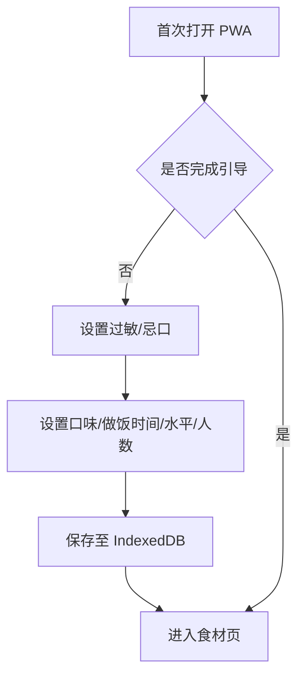
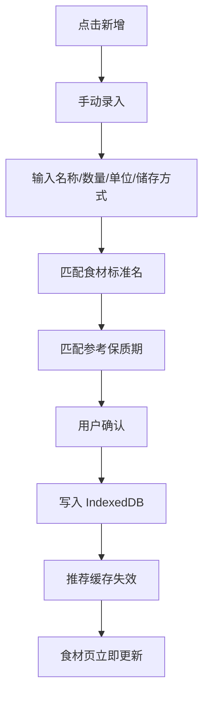
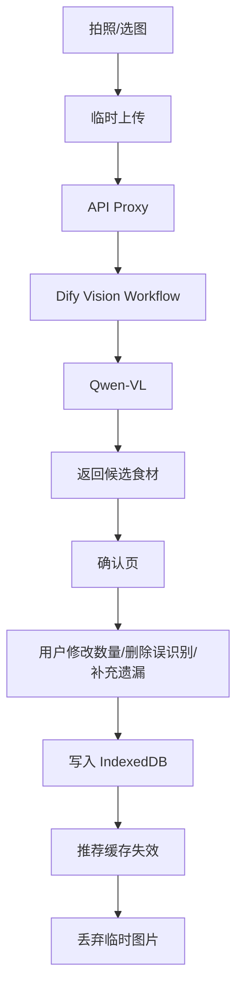
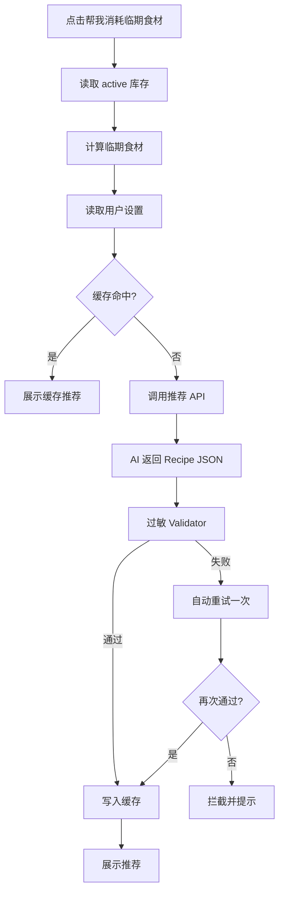
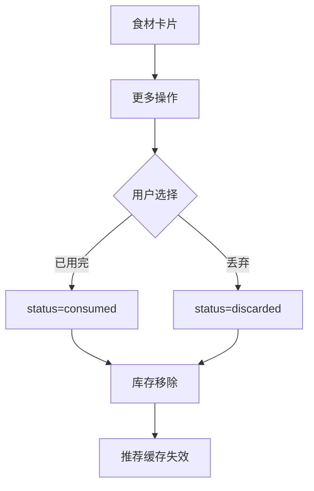

# AI家庭食材菜谱助手｜产品需求文档（PRD）

**文档版本**：V1.1-MVP  
**升级日期**：2026-08-16  
**产品形态**：可安装 PWA Web App  
**目标平台**：移动端优先，兼容 PC 浏览器  
**AI方案**：Dify + 中国主流大模型 API（优先阿里云百炼 Qwen / Qwen-VL）  
**数据策略**：Local-First，本地 IndexedDB 持久化；云端能力只负责 AI 调用，不承担高频页面 CRUD  
**开发原则**：一人可实现、成本可控、数据不因关闭页面丢失、操作流畅、后续可扩展

---

## 0. V1.1 升级摘要

V1.1 在 V1.0“食材库存 + AI问答 + 推荐 + 收藏 + 饮食设置”的业务闭环基础上，重点解决以下问题：

1. **解决“添加到桌面”与“不做 PWA”的冲突**  
   MVP 直接采用 PWA，支持手机/电脑添加至主屏幕或桌面。

2. **解决页面关闭后数据持久化与远程依赖问题**  
   MVP 直接采用 IndexedDB 作为主数据存储，关闭页面、刷新浏览器后数据不丢失。

3. **降低飞书多维表格对实时体验的影响**  
   飞书不再承担核心实时数据库职责。V1.1 默认不依赖飞书完成页面读写；如需作品集数据观察，可作为可选的备份/运营观察层。

4. **明确 Dify 的职责边界**  
   Dify 仅负责 AI Chatflow / Workflow 编排，不承担 4 Tab 完整产品前端。

5. **解决浏览器暴露 API Key 的风险**  
   新增轻量 API Proxy / Serverless Function，浏览器只请求自有后端接口，由后端调用 Dify 和模型平台。

6. **减少不必要的大模型调用**  
   新鲜度计算、筛选、收藏、排序、CRUD、缓存命中等均由前端代码完成，不调用 LLM。

7. **强化产品核心价值**  
   产品从“AI 菜谱生成器”升级为“知道家里有什么、什么快坏了、用户不能吃什么，并帮助决定今天吃什么的 AI 家庭厨房助手”。

8. **新增食材生命周期状态**  
   不再只有“添加/删除”，增加“已用完”和“丢弃”状态，为后续浪费分析和个性化推荐积累数据。

9. **解决 AI 输出难以稳定渲染的问题**  
   菜谱统一使用结构化 Recipe JSON Schema，不依赖自由文本格式。

10. **提升饮食安全约束**  
    过敏规则采用“Prompt 约束 + 程序 Validator 二次校验”的双保险方案。

11. **优化推荐成本与稳定性**  
    新增推荐缓存。库存、饮食设置未变化时优先读取缓存，不重复调用模型。

12. **优化信息架构**  
    4 个 Tab 调整为：**食材 / 今天吃什么 / AI厨房 / 我的**，用户路径更符合实际使用场景。

---

# 一、产品概述

## 1.1 产品背景

家庭做饭用户常见以下问题：

1. 家中食材种类多，容易忘记已有库存；
2. 食材临期后才发现，导致浪费；
3. 每天需要反复决定“今天吃什么”，选择成本高；
4. 用户虽然有现成食材，但不知道如何组合成菜；
5. 有过敏、忌口、口味偏好的用户，需要反复向 AI 说明限制；
6. 普通 AI 菜谱工具不了解用户真实库存和临期状态，推荐结果与现实脱节。

本产品通过“**家庭食材库存作为 Context、食材临期状态作为 Trigger、AI 作为 Decision Engine、菜谱作为 Output**”的方式，为用户提供更贴近真实家庭做饭场景的 AI 决策辅助。

---

## 1.2 产品定位

> 一个知道你家里有什么、什么快坏了、你不能吃什么，并主动帮你决定今天吃什么的 AI 家庭厨房助手。

产品不以“生成菜谱”作为唯一价值，而是围绕：

**记录食材 → 发现临期 → 决定吃什么 → 生成菜谱 → 消耗库存 → 沉淀偏好**

形成完整闭环。

---

## 1.3 目标用户

### 核心用户

- 日常在家做饭的单人或小家庭用户；
- 经常买菜但容易忘记冰箱里有什么的人；
- 希望减少家庭食材浪费的人；
- 经常纠结“今天吃什么”的用户；
- 有食物过敏、忌口或明确口味偏好的人。

### 非核心用户

- 专业厨师；
- 餐饮门店；
- 需要精确营养、医疗级饮食管理的人群；
- 需要多人共享实时库存的家庭。

以上场景不属于 V1.1 MVP 重点。

---

## 1.4 MVP 核心目标

V1.1 MVP 必须完成以下目标：

1. 用户可在手机和电脑浏览器正常使用产品；
2. 支持安装为 PWA，添加至手机主屏幕或电脑桌面；
3. 用户录入的食材、收藏、设置、聊天记录在关闭页面后仍然保留；
4. 用户可手动录入食材；
5. 用户可拍照识别食材，并在确认页修改后入库；
6. 系统自动计算食材预计新鲜度和临期状态；
7. 用户可将食材标记为“已用完”或“丢弃”；
8. AI 可根据当前库存、临期食材和饮食限制生成菜谱；
9. 提供“今天吃什么”场景化推荐；
10. 提供自由对话式 AI 厨房助手；
11. 支持收藏菜谱；
12. 支持设置过敏、忌口、口味、烹饪时间、水平和默认人数；
13. 所有 AI 菜谱必须经过过敏食材程序校验；
14. 推荐结果支持缓存，避免重复消耗 Token；
15. API Key 不得出现在浏览器前端代码中；
16. 在一人开发、可控预算条件下完成。

---

## 1.5 MVP 成功标准

### 产品可用性

- 用户可以独立完成“添加食材 → 查看临期 → 获取推荐 → 查看菜谱 → 标记已用完”的完整流程；
- 所有关键功能不依赖刷新页面才能更新；
- 关键数据刷新/关闭页面后不丢失。

### 性能目标

- PWA 首次首屏可交互：目标 ≤ 3 秒；
- 二次进入页面：目标 ≤ 1.5 秒；
- 本地食材列表读取：目标 ≤ 300 ms；
- 本地筛选/排序操作：感知上即时完成；
- AI 请求发送后 500 ms 内显示加载/流式反馈状态；
- 文本模型首字响应目标 ≤ 5 秒；
- 图片识别目标 ≤ 8 秒；
- 非 AI 功能不得因为模型不可用而失效。

### 成本目标

- 普通页面浏览：0 次 LLM 调用；
- 本地筛选：0 次 LLM 调用；
- 收藏/取消收藏：0 次 LLM 调用；
- 新鲜度计算：0 次 LLM 调用；
- 推荐缓存命中：0 次 LLM 调用；
- 仅在图片识别、生成推荐、自由问答等必要场景调用 AI。

---

## 1.6 MVP 不做范围

V1.1 暂不实现：

1. 多用户账号体系；
2. 多设备云同步；
3. 家庭成员协同库存；
4. 支付功能；
5. 社区分享；
6. 评论体系；
7. 菜谱创作者体系；
8. 工业级推荐算法；
9. 协同过滤；
10. 向量召回；
11. 完整 RAG 菜谱知识库；
12. 精确营养计算；
13. 医疗级饮食建议；
14. 条码扫描；
15. OCR 小票自动入库；
16. 保存用户原始食材照片；
17. 原生 iOS / Android App；
18. 后台运营管理系统。

---

## 1.7 后续版本规划

| 版本 | 主要内容 |
|---|---|
| V1.1 MVP | PWA、本地库存、拍照识别、今天吃什么、AI厨房、收藏、饮食设置、推荐缓存、过敏校验 |
| V1.2 | RAG 真实菜谱知识库、菜谱可信度提升、食材别名词典增强 |
| V1.3 | 云同步、用户账号、多设备数据同步 |
| V1.4 | 家庭共享冰箱、多人偏好冲突处理 |
| V1.5 | 购物清单、食材补货提醒、消费/浪费统计 |
| V2.0 | 更完整的个性化推荐、营养目标、智能周菜单 |

---

# 二、产品设计原则

## 2.1 Local-First

用户自己的库存、设置、收藏和历史记录优先保存在本地 IndexedDB。

原则：

- 页面打开先读本地数据；
- 页面状态变化先更新本地；
- AI 服务异常时，本地库存功能仍可正常使用；
- 不因为远程数据库异常导致“冰箱打不开”。

---

## 2.2 AI 只做 AI 擅长的事情

### 使用 AI

- 图片识别；
- 菜谱生成；
- 自然语言问答；
- 个性化推荐解释；
- 用户需求理解。

### 不使用 AI

- 新鲜度计算；
- 日期计算；
- 筛选；
- 排序；
- 收藏；
- CRUD；
- 过敏关键词程序校验；
- 推荐缓存判断；
- 页面状态管理。

---

## 2.3 可解释推荐

推荐卡片必须告诉用户：

- 为什么推荐；
- 使用了哪些库存食材；
- 是否优先消耗临期食材；
- 是否符合用户偏好；
- 预计烹饪时长。

避免只有“AI 猜你喜欢”。

---

## 2.4 用户确认优先

以下 AI 结果不得直接作为最终事实写入库存：

- 图片识别出的食材；
- 图片推测的数量；
- AI 推测的保质期；
- AI 推测的食材状态。

必须给用户确认或编辑机会。

---

## 2.5 安全优先于生成效果

涉及过敏食材时：

> 宁可本次推荐失败，也不展示疑似违反过敏规则的菜谱。

---

# 三、信息架构

## 3.1 一级导航

底部固定 4 Tab：

| Tab | 名称 | 核心问题 |
|---|---|---|
| Tab1 | 食材 | 我家里现在有什么？ |
| Tab2 | 今天吃什么 | 我现在可以做什么？ |
| Tab3 | AI厨房 | 我有具体问题怎么办？ |
| Tab4 | 我的 | 我的收藏和饮食偏好是什么？ |

---

## 3.2 页面结构

```text
App
├── 首次使用引导
│   └── 饮食偏好初始化
│
├── Tab1 食材
│   ├── 食材列表
│   ├── 手动录入
│   ├── 拍照识别
│   ├── 识别确认
│   ├── 食材详情
│   └── 批量管理
│
├── Tab2 今天吃什么
│   ├── 场景快捷入口
│   ├── 推荐列表
│   └── 菜谱详情
│
├── Tab3 AI厨房
│   ├── 快捷问题
│   ├── 对话列表
│   └── 菜谱卡片
│
└── Tab4 我的
    ├── 我的收藏
    ├── 饮食设置
    ├── 烹饪偏好
    ├── 数据管理
    └── 关于与免责声明
```

---

# 四、首次使用引导

## 4.1 设计目标

避免新用户推荐冷启动。

首次进入 App 时，不强制注册，只进行轻量偏好初始化。

---

## 4.2 初始化字段

### 饮食安全

- 过敏食材；
- 忌口食材。

均允许跳过。

### 口味偏好

多选：

- 清淡；
- 家常；
- 香辣；
- 酸甜；
- 咸鲜；
- 无明显偏好。

### 默认做饭时间

单选：

- 15 分钟以内；
- 30 分钟以内；
- 60 分钟以内；
- 不限制。

### 烹饪水平

- 新手；
- 普通；
- 熟练。

### 默认用餐人数

- 1 人；
- 2 人；
- 3 人；
- 4 人及以上。

---

## 4.3 交互规则

1. 所有步骤均可跳过；
2. 完成后写入本地 `settings`；
3. 后续可在“我的”中修改；
4. 修改后使推荐缓存立即失效。

---

# 五、Tab1：食材

## 5.1 页面定位

作为家庭库存中心，帮助用户快速回答：

- 我现在有什么？
- 哪些要尽快吃？
- 哪些已经过期？
- 我该优先消耗什么？

---

## 5.2 页面布局

### 顶部概览卡

展示：

- 当前食材种类；
- 临期食材数量；
- 预计已过期数量；
- “帮我消耗临期食材”快捷按钮。

示例：

```text
我的厨房

12 种食材    2 种临期
1 种预计已过期

[ ✨ 帮我消耗临期食材 ]
```

点击后跳转至“今天吃什么”，自动带入：

```text
recommendMode = expiring_first
```

---

## 5.3 筛选栏

筛选项：

- 全部；
- 新鲜；
- 尽快食用；
- 临期；
- 预计已过期。

默认：全部。

筛选仅使用前端本地数据，不调用 AI。

---

## 5.4 新鲜度状态统一规范

| 状态 | 颜色 | 规则 |
|---|---|---|
| 新鲜 | 绿色 | `remainingDays > 5` |
| 尽快食用 | 黄色 | `2 < remainingDays <= 5` |
| 临期 | 橙色 | `0 < remainingDays <= 2` |
| 预计已过期 | 红色 | `remainingDays <= 0` |

页面统一使用以上颜色，不再使用灰色表示风险状态。

---

## 5.5 食材卡片

每张卡片展示：

- 固定食材图标；
- 食材名称；
- 数量 + 单位；
- “预计剩余 X 天”或“已存放 X 天”；
- 新鲜度标签；
- 更多操作 `⋮`。

示例：

```text
🍅
番茄                 ⋮
2 个
预计剩余 1 天
[临期]
```

---

## 5.6 更多操作

点击 `⋮`：

- 编辑；
- 标记已用完；
- 标记丢弃；
- 删除记录。

不再以长按作为核心操作入口。

---

## 5.7 “已用完”与“丢弃”的区别

### 已用完

表示食材被正常消费。

```text
status = consumed
```

### 丢弃

表示食材因变质、过期等原因被丢掉。

```text
status = discarded
```

### 删除

仅用于：

- 误录；
- 测试数据；
- 用户明确不希望保留的记录。

删除不会作为消费行为进入后续统计。

---

## 5.8 库存页面默认数据范围

食材列表默认只显示：

```text
status = active
```

“已用完/丢弃”不展示在当前库存中，但保留本地记录，为后续个性化和浪费统计使用。

---

## 5.9 手动录入

字段：

| 字段 | 必填 | 默认 |
|---|---|---|
| 食材名称 | 是 | - |
| 数量 | 是 | 1 |
| 单位 | 是 | 根据食材建议，可修改 |
| 入库日期 | 是 | 当前日期 |
| 储存方式 | 否 | 冷藏 |
| 自定义到期日 | 否 | 空 |

储存方式：

- 冷藏；
- 冷冻；
- 常温。

---

## 5.10 拍照识别

入口：

- 食材页浮动 `+`；
- 添加食材页；
- 首次空状态。

流程：

```text
拍照/选择图片
→ 上传临时图片
→ API Proxy
→ Dify 图片识别 Workflow
→ Qwen-VL
→ 返回候选食材
→ 前端识别确认页
→ 用户修改数量/单位/食材
→ 写入 IndexedDB
→ 临时图片生命周期结束
```

---

## 5.11 VL 返回数据

推荐模型只返回候选项：

```json
{
  "items": [
    {
      "name": "番茄",
      "confidence": 0.93
    },
    {
      "name": "鸡蛋",
      "confidence": 0.88
    }
  ]
}
```

数量不作为强制识别项。

如果模型尝试识别数量，前端只能作为建议展示，必须允许用户确认。

---

## 5.12 识别确认页

示例：

```text
识别到 2 种食材

🍅 番茄
[-] 2 [+]   单位：个

🥚 鸡蛋
[-] 6 [+]   单位：个

+ 添加遗漏食材
× 删除误识别食材

[确认入库]
```

---

## 5.13 食材详情页

展示：

- 图标；
- 食材名称；
- 当前数量；
- 入库日期；
- 已存放天数；
- 预计剩余天数；
- 新鲜度；
- 储存方式；
- 新鲜度免责声明。

操作：

- 编辑；
- 已用完；
- 丢弃；
- 用它做菜。

### 用它做菜

点击后不直接在详情页重复建立一套推荐逻辑，而是跳转至“今天吃什么”，附带：

```json
{
  "recommendMode": "ingredient_focus",
  "ingredientId": "xxx"
}
```

避免多个页面重复维护 AI 菜谱功能。

---

## 5.14 空状态

无食材时：

```text
冰箱还是空的

添加一些食材后，我可以帮你：
• 发现快过期的食材
• 根据现有食材推荐菜谱
• 减少重复购买和浪费

[拍照添加]
[手动添加]
```

---

# 六、Tab2：今天吃什么

## 6.1 页面定位

这是产品的核心决策页面。

不只是“推荐菜谱”，而是结合：

- 当前库存；
- 临期程度；
- 用户饮食约束；
- 用户口味；
- 用户做饭时间；
- 用户烹饪水平；

帮助用户决定当前最适合做什么。

---

## 6.2 顶部场景快捷入口

提供四个核心模式：

1. **优先消耗临期**
2. **只用家里现有食材**
3. **20 分钟快手菜**
4. **随便推荐**

同时保留：

- 换一批。

---

## 6.3 推荐输入上下文

AI 输入包括：

```json
{
  "inventory": [],
  "expiringIngredients": [],
  "allergies": [],
  "dislikes": [],
  "tastePreferences": [],
  "maxCookTime": 30,
  "skillLevel": "beginner",
  "servings": 2,
  "recommendMode": "expiring_first"
}
```

---

## 6.4 推荐卡片

每张卡片展示：

- 菜名；
- 一句话介绍；
- 预计烹饪时长；
- 难度；
- 可消耗的现有食材；
- 是否使用临期食材；
- 推荐理由；
- 收藏按钮。

示例：

```text
番茄炒蛋

15 分钟 · 简单

可消耗：
🍅 番茄 × 2
🥚 鸡蛋 × 3

推荐理由：
✓ 可以优先消耗预计明天临期的番茄
✓ 所需主料家中已有
✓ 符合 20 分钟以内做饭偏好

♡ 收藏
```

---

## 6.5 推荐排序原则

推荐结果生成后，前端可做简单规则加权，不需要再次调用 AI。

推荐优先级：

1. 无过敏风险；
2. 使用临期食材；
3. 使用更多现有食材；
4. 符合用户时间限制；
5. 符合用户口味；
6. 难度符合用户水平。

---

## 6.6 推荐缓存

新增：

```text
recommendationCache
```

缓存 Key 由以下上下文生成：

```text
activeInventoryHash
+ settingsHash
+ recommendMode
```

### 缓存命中条件

同时满足：

- 当前库存没有变化；
- 饮食设置没有变化；
- 推荐模式相同；
- 缓存未超过 24 小时。

则：

```text
直接读取本地缓存
不调用 LLM
```

---

## 6.7 缓存失效条件

以下任一发生：

- 新增食材；
- 编辑食材；
- 食材已用完；
- 食材丢弃；
- 修改过敏；
- 修改忌口；
- 修改口味；
- 修改烹饪偏好；
- 用户主动点击“换一批”。

---

## 6.8 菜谱详情

展示：

1. 菜名；
2. 推荐理由；
3. 总时长；
4. 难度；
5. 份数；
6. 食材清单；
7. 库存内食材标识；
8. 需要额外准备的食材；
9. 详细步骤；
10. 注意事项；
11. 收藏。

可额外展示：

```text
家中已有 4/6 种主要食材
```

---

# 七、Tab3：AI厨房

## 7.1 页面定位

自由问答式厨房助手。

适用于用户已经产生具体问题，例如：

- 鸡蛋和豆腐怎么一起做？
- 今天想吃清淡一点；
- 没有料酒可以用什么代替？
- 这道菜怎么做得更简单？
- 只有 15 分钟能做什么？

---

## 7.2 首屏设计

避免空白聊天页。

首次进入展示快捷问题：

```text
👨‍🍳 AI厨房

你可以直接问我：

[ 用临期食材安排晚饭 ]
[ 20分钟能做什么 ]
[ 根据冰箱现有食材做一道菜 ]
[ 今天想吃清淡一点 ]

输入你的问题……
```

---

## 7.3 对话规则

每次请求默认注入：

- 用户过敏；
- 用户忌口；
- 基础口味偏好。

当用户提问涉及：

- 家里有什么；
- 冰箱；
- 库存；
- 现有食材；
- 快过期；
- 用掉某食材；

则同时注入当前库存。

为了 MVP 工程简单，也可以默认始终传入“精简后的 active 库存”。

---

## 7.4 对话持久化

本地保存：

- conversation；
- message。

关闭页面后再次进入，聊天记录仍存在。

---

## 7.5 AI 响应类型

AI 可返回两类内容：

### 普通文本

例如：

- 烹饪技巧；
- 食材替代；
- 做菜建议。

### Recipe Card

如果回答中生成菜谱，则返回结构化菜谱数据，由前端渲染卡片。

---

## 7.6 流式响应

文本对话优先使用流式返回。

UI：

```text
用户发送
→ 用户消息立即显示
→ 显示 AI 思考/加载状态
→ 开始逐字显示
→ 菜谱结构完整后渲染菜谱卡片
```

---

## 7.7 错误状态

### 网络失败

```text
网络似乎不太稳定，本地食材数据仍然安全。
[重新发送]
```

### AI 服务失败

```text
AI厨房暂时开小差了，请稍后再试。
```

### 过敏校验失败

不展示危险菜谱。

```text
这次生成的结果未通过饮食安全检查，已为你拦截。
[重新生成]
```

---

# 八、Tab4：我的

## 8.1 页面模块

1. 我的收藏；
2. 饮食安全；
3. 口味偏好；
4. 烹饪偏好；
5. 数据管理；
6. 关于与免责声明。

---

## 8.2 我的收藏

展示收藏菜谱。

支持：

- 查看；
- 取消收藏；
- 按收藏时间排序；
- 来源标识。

来源：

```text
today_recommendation
ai_chat
ingredient_focus
```

---

## 8.3 饮食安全

### 过敏食材

强约束。

支持：

- 添加；
- 删除；
- 编辑。

### 忌口食材

软约束。

支持：

- 添加；
- 删除；
- 编辑。

修改后：

```text
settings 更新
→ recommendationCache 失效
```

---

## 8.4 烹饪偏好

字段：

- 口味；
- 默认最长烹饪时间；
- 烹饪水平；
- 默认人数。

---

## 8.5 数据管理

V1.1 提供：

### 清空聊天记录

只删除 conversations/messages。

### 清空推荐缓存

删除 recommendationCache。

### 清空全部本地数据

二次确认：

```text
该操作会删除本设备上的食材、收藏、设置和聊天记录，且无法恢复。
```

---

## 8.6 关于与免责声明

至少包含：

> 食材新鲜度为基于录入时间和参考保质期的估算结果，实际情况会受到储存方式、购买时状态、包装、温度等因素影响，请结合食材实际状态判断。

> AI 生成菜谱仅供家庭烹饪参考。对于严重食物过敏用户，请务必再次人工核对菜谱食材及调味品成分，本产品不能替代专业医疗建议。

---

# 九、PWA 设计

## 9.1 MVP 必须支持

- `manifest.json`；
- 应用名称；
- 应用图标；
- `display: standalone`；
- Service Worker；
- 静态资源缓存；
- HTTPS；
- 添加到手机主屏幕；
- PC 支持安装为桌面 Web App。

---

## 9.2 离线能力边界

### 离线可用

- 查看食材；
- 添加/编辑/删除食材；
- 查看收藏；
- 查看历史聊天；
- 修改设置；
- 查看已缓存的推荐。

### 离线不可用

- 图片 AI 识别；
- 新 AI 菜谱生成；
- AI 对话；
- 刷新推荐。

---

# 十、数据设计

V1.1 主数据存储：

```text
IndexedDB
```

推荐使用：

```text
Dexie.js
```

进行 IndexedDB 封装，降低开发复杂度。

---

## 10.1 ingredients

```ts
interface Ingredient {
  id: string;
  name: string;
  normalizedName: string;
  category?: string;

  quantity: number;
  unit: string;

  storage: "fridge" | "freezer" | "room";

  addedAt: string;
  shelfLifeDays: number;
  customExpireAt?: string | null;

  iconKey: string;

  status: "active" | "consumed" | "discarded";

  consumedAt?: string | null;
  discardedAt?: string | null;

  source: "manual" | "vision";

  createdAt: string;
  updatedAt: string;
}
```

---

## 10.2 freshness 不写入数据库

以下字段实时计算：

```ts
storedDays
estimatedExpireAt
remainingDays
freshnessLevel
```

原因：

时间不断变化，如果把 freshness 固定存储，会出现数据库状态过期的问题。

---

## 10.3 settings

```ts
interface UserSettings {
  id: "default";

  allergies: string[];
  dislikes: string[];

  tastePreferences: string[];

  maxCookTime: 15 | 30 | 60 | null;

  skillLevel: "beginner" | "normal" | "advanced";

  servings: number;

  onboardingCompleted: boolean;

  createdAt: string;
  updatedAt: string;
}
```

---

## 10.4 favorites

收藏不直接只存一大段文本，而是保存结构化菜谱。

```ts
interface FavoriteRecipe {
  id: string;

  recipe: Recipe;

  source:
    | "today_recommendation"
    | "ai_chat"
    | "ingredient_focus";

  createdAt: string;
}
```

---

## 10.5 conversations

```ts
interface Conversation {
  id: string;
  title: string;
  difyConversationId?: string | null;
  createdAt: string;
  updatedAt: string;
}
```

---

## 10.6 messages

```ts
interface Message {
  id: string;
  conversationId: string;

  role: "user" | "assistant";

  content: string;

  recipes?: Recipe[];

  createdAt: string;
}
```

---

## 10.7 recommendationCache

```ts
interface RecommendationCache {
  id: string;

  cacheKey: string;

  mode:
    | "expiring_first"
    | "inventory_only"
    | "quick_20"
    | "random"
    | "ingredient_focus";

  recipes: Recipe[];

  createdAt: string;
  expiresAt: string;
}
```

---

# 十一、统一 Recipe JSON Schema

## 11.1 Recipe

```ts
interface Recipe {
  id: string;

  title: string;
  description: string;

  reason: string;

  cookTimeMinutes: number;

  difficulty:
    | "简单"
    | "普通"
    | "进阶";

  servings: number;

  ingredients: RecipeIngredient[];

  steps: RecipeStep[];

  tips?: string[];

  usedInventoryIngredientIds?: string[];

  expiringIngredientIds?: string[];
}
```

---

## 11.2 RecipeIngredient

```ts
interface RecipeIngredient {
  name: string;
  normalizedName: string;

  amount: string;

  fromInventory: boolean;

  inventoryIngredientId?: string | null;

  optional?: boolean;

  substitute?: string | null;
}
```

---

## 11.3 RecipeStep

```ts
interface RecipeStep {
  order: number;
  text: string;
}
```

---

## 11.4 AI 推荐返回示例

```json
{
  "recipes": [
    {
      "id": "recipe_001",
      "title": "番茄炒蛋",
      "description": "适合快速完成的家常菜。",
      "reason": "优先消耗预计明天临期的番茄，同时主要食材家中已有。",
      "cookTimeMinutes": 15,
      "difficulty": "简单",
      "servings": 2,
      "ingredients": [
        {
          "name": "番茄",
          "normalizedName": "番茄",
          "amount": "2个",
          "fromInventory": true,
          "inventoryIngredientId": "ing_001",
          "optional": false,
          "substitute": null
        },
        {
          "name": "鸡蛋",
          "normalizedName": "鸡蛋",
          "amount": "3个",
          "fromInventory": true,
          "inventoryIngredientId": "ing_002",
          "optional": false,
          "substitute": null
        }
      ],
      "steps": [
        {
          "order": 1,
          "text": "番茄洗净切块，鸡蛋打散。"
        },
        {
          "order": 2,
          "text": "锅中少量油，将鸡蛋炒熟盛出。"
        },
        {
          "order": 3,
          "text": "加入番茄翻炒，再加入鸡蛋调味即可。"
        }
      ],
      "tips": [
        "番茄较酸时可加入少量糖平衡味道。"
      ],
      "usedInventoryIngredientIds": [
        "ing_001",
        "ing_002"
      ],
      "expiringIngredientIds": [
        "ing_001"
      ]
    }
  ]
}
```

---

# 十二、食材标准化

## 12.1 为什么需要 normalizedName

用户可能输入：

```text
西红柿
番茄
小番茄
圣女果
```

模型也可能输出不同叫法。

MVP 使用简单别名表：

```json
{
  "西红柿": "番茄",
  "番茄": "番茄",
  "土豆": "土豆",
  "马铃薯": "土豆"
}
```

---

## 12.2 应用场景

用于：

- 图标匹配；
- 保质期匹配；
- 过敏校验；
- 库存匹配；
- 菜谱 ingredients 对应库存。

---

# 十三、新鲜度与保质期

## 13.1 静态配置

示例：

```json
{
  "番茄": {
    "fridge": 7,
    "room": 3,
    "freezer": 30
  },
  "鸡蛋": {
    "fridge": 14,
    "room": 5,
    "freezer": null
  },
  "土豆": {
    "fridge": 14,
    "room": 20,
    "freezer": 60
  },
  "default": {
    "fridge": 5,
    "room": 3,
    "freezer": 14
  }
}
```

以上仅为产品示例配置，正式上线前需单独校验具体食材参考值。

---

## 13.2 计算逻辑

如果存在：

```text
customExpireAt
```

优先使用用户自定义到期日期。

否则：

```text
estimatedExpireAt
=
addedAt + shelfLifeDays
```

```text
remainingDays
=
estimatedExpireAt - today
```

---

## 13.3 UI 文案

禁止使用：

```text
“还有 2 天一定过期”
```

建议：

```text
“预计剩余 2 天”
```

---

# 十四、AI 系统架构

```text
PWA Frontend
│
├── React
├── TypeScript
├── IndexedDB / Dexie
├── PWA / Service Worker
│
└── HTTPS
     │
     ▼
API Proxy / Serverless Function
│
├── 隐藏 Dify API Key
├── 基础限流
├── 参数校验
├── 请求超时
├── 错误标准化
└── 可选日志
     │
     ▼
Dify
│
├── Workflow A：图片食材识别
├── Workflow B：菜谱推荐
└── Chatflow C：AI 厨房对话
     │
     ▼
中国主流大模型 API
├── Qwen-VL
└── Qwen Text
```

---

# 十五、推荐技术栈

## 15.1 前端

推荐：

```text
React
Vite
TypeScript
```

原因：

- AI Coding 工具支持成熟；
- 生态完善；
- PWA 配置简单；
- 后续扩展容易。

---

## 15.2 UI

二选一：

### 方案 A：Tailwind CSS

适合：

- 快速自定义移动端视觉；
- AI Coding；
- 作品集 Demo。

### 方案 B：Ant Design Mobile

适合：

- 更快搭建成熟移动端组件。

推荐 V1.1：

```text
React + Tailwind CSS
```

以便视觉更接近独立消费级产品，而不是后台系统。

---

## 15.3 本地数据库

```text
IndexedDB + Dexie.js
```

---

## 15.4 PWA

```text
vite-plugin-pwa
```

---

## 15.5 后端 Proxy

推荐 Serverless：

```text
Vercel Functions
或
Cloudflare Workers
或
国内可访问的 Serverless 服务
```

如果作品最终主要在中国大陆网络环境展示，部署平台需提前验证访问稳定性。

---

## 15.6 AI 编排

```text
Dify
```

仅作为：

- Workflow；
- Chatflow；
- Prompt 管理；
- 模型切换；
- 调试观察。

---

## 15.7 模型

优先：

```text
阿里云百炼
```

模型策略：

| 场景 | 模型 |
|---|---|
| 图片识别 | Qwen-VL |
| 普通推荐 | 低成本 Qwen 文本模型 |
| 普通厨房问答 | 低成本/中等模型 |
| 复杂问答 | 必要时升级较强模型 |

---

# 十六、API Proxy

## 16.1 原则

前端禁止保存：

- Dify API Key；
- 百炼 API Key。

浏览器只能请求：

```text
/api/vision
/api/recommend
/api/chat
```

---

## 16.2 接口 1：图片识别

```http
POST /api/vision
```

输入：

```text
multipart/form-data
image
```

输出：

```json
{
  "success": true,
  "items": [
    {
      "name": "番茄",
      "confidence": 0.93
    }
  ]
}
```

---

## 16.3 接口 2：推荐

```http
POST /api/recommend
```

输入：

```json
{
  "inventory": [],
  "settings": {},
  "mode": "expiring_first"
}
```

输出：

```json
{
  "success": true,
  "recipes": []
}
```

---

## 16.4 接口 3：AI 对话

```http
POST /api/chat
```

输入：

```json
{
  "conversationId": "xxx",
  "message": "今晚吃什么？",
  "inventory": [],
  "settings": {}
}
```

输出优先使用 Streaming。

---

# 十七、过敏安全校验

## 17.1 双层校验

### 第一层：Prompt

明确要求：

- 所有过敏项严禁出现在菜谱；
- 不得以调味品、酱料、配料形式间接出现；
- 不确定时优先不推荐。

### 第二层：程序 Validator

AI 输出 Recipe JSON 后，前端展示前必须校验。

---

## 17.2 基础 Validator

假设：

```text
allergies = ["花生"]
```

检查：

```text
recipe.ingredients[].normalizedName
```

并支持简单扩展词典：

```json
{
  "花生": [
    "花生",
    "花生米",
    "花生碎",
    "花生酱",
    "花生油"
  ]
}
```

---

## 17.3 校验失败策略

第一次失败：

```text
自动携带失败原因重试一次
```

第二次仍失败：

```text
停止展示
```

返回：

```text
这次菜谱没有通过饮食安全检查，请重新生成。
```

---

## 17.4 产品边界

MVP 不宣称：

```text
100% 保证食品安全
```

严重过敏用户仍需自行核对实际食材包装、调味料和交叉污染风险。

---

# 十八、Prompt 设计

## 18.1 图片识别 Prompt

```text
你是家庭食材识别助手。

任务：
识别图片中可以作为家庭烹饪原料的主要食材。

要求：
1. 只识别食材，不识别餐具、包装、厨具；
2. 使用常见中文食材名称；
3. 不判断食材是否新鲜；
4. 不推测保质期；
5. 不将数量作为可靠事实；
6. 输出严格 JSON；
7. 如果无法识别，items 返回空数组。

输出：
{
  "items": [
    {
      "name": "番茄",
      "confidence": 0.93
    }
  ]
}
```

---

## 18.2 推荐 System Prompt 核心规则

```text
你是 AI 家庭厨房助手。

你的任务不是单纯生成菜谱，而是根据：
- 用户当前库存；
- 临期食材；
- 过敏和忌口；
- 用户口味；
- 做饭时长；
- 烹饪水平；
- 用餐人数；

帮助用户选择当前最适合制作的家庭菜肴。

优先级：
1. 食品安全；
2. 严格避开过敏食材；
3. 尽量使用用户已有库存；
4. 在 expiring_first 模式下优先消耗临期食材；
5. 符合用户时间和难度限制；
6. 菜谱必须普通家庭可操作。

严禁：
- 输出不确定的医学建议；
- 为了消耗库存强行搭配明显不合理食材；
- 使用用户过敏食材；
- 编造用户拥有的食材。

必须返回符合 Recipe JSON Schema 的严格 JSON。
```

---

## 18.3 AI厨房 System Prompt 核心规则

```text
你是家庭厨房 AI 助手。

你可以回答：
- 做菜方法；
- 食材组合；
- 食材替代；
- 做饭时间安排；
- 家庭烹饪技巧。

每次回答必须遵守用户饮食约束。

如果回答包含完整菜谱：
使用统一 Recipe JSON Schema 返回 recipes。

如果只是普通厨房解释：
允许返回普通文本。

过敏食材属于最高优先级约束。
```

---

# 十九、关键业务流程

## 19.1 首次使用



---

## 19.2 手动录入



---

## 19.3 拍照识别



---

## 19.4 临期推荐



---

## 19.5 食材消费



---

# 二十、页面设计规范

## 20.1 设计关键词

- 家庭感；
- 清爽；
- 温暖；
- 食欲感；
- 轻 AI；
- 低学习成本。

避免：

- 后台管理系统视觉；
- 大量复杂表格；
- 过多 AI 科技蓝；
- 信息堆砌。

---

## 20.2 移动端优先

基准设计宽度：

```text
375px / 390px
```

PC：

- 内容区域居中；
- 最大宽度约 960px；
- 不简单把手机页面无限拉宽。

---

## 20.3 底部导航

固定底部：

```text
食材 | 今天吃什么 | AI厨房 | 我的
```

移动端考虑 Safe Area。

---

## 20.4 主按钮层级

每个页面只保留一个明显主动作。

### 食材

```text
+
```

### 今天吃什么

```text
换一批
```

### AI厨房

```text
发送
```

### 我的

设置采用自动保存或统一保存，避免同时出现过多按钮。

---

## 20.5 加载体验

AI 请求禁止整页白屏。

推荐使用 Skeleton：

```text
AI 正在结合你的库存和临期食材思考…
```

页面其他功能仍可操作。

---

## 20.6 空状态必须有下一步动作

所有空状态都必须提供 CTA。

例如收藏为空：

```text
还没有收藏菜谱

去“今天吃什么”发现第一道菜吧。

[去看看]
```

---

# 二十一、成本控制

## 21.1 调用原则

```text
能用代码解决 → 不调用 AI
能读缓存 → 不调用 AI
能用低成本模型 → 不使用高成本模型
```

---

## 21.2 推荐调用限制

客户端可做基础防抖：

```text
换一批按钮请求过程中禁用
```

后端进行基础限流。

例如 Demo 可配置：

```text
同一 IP / Session
每分钟最多 N 次 AI 请求
```

具体数值根据部署和额度调整。

---

## 21.3 图片识别

只在用户主动点击确认上传后调用。

不做：

- 页面后台自动识图；
- 原图永久存储；
- 图片历史回看。

---

# 二十二、异常处理

## 22.1 IndexedDB 异常

提示：

```text
本地数据保存失败，请检查浏览器存储权限。
```

关键写入需要 try/catch。

---

## 22.2 API 超时

推荐：

```text
15~30 秒后主动中止
```

展示：

```text
这次生成有点久，请重新试一次。
```

---

## 22.3 JSON 解析失败

如果 AI 输出不符合 Schema：

```text
Dify/Proxy 尝试结构化修复或重试
```

仍失败：

```text
本次结果格式异常，请重新生成。
```

前端禁止强行解析不完整数据。

---

## 22.4 图片识别为空

```text
没有识别到明确食材。

你可以：
[重新拍照]
[手动添加]
```

---

# 二十三、非功能需求

## 23.1 安全

- API Key 仅在服务器环境变量；
- HTTPS；
- 基础限流；
- 图片不永久存储；
- 不上传无关本地数据；
- 过敏 Validator；
- 错误日志避免记录完整敏感输入。

---

## 23.2 隐私

MVP 单用户本地产品。

默认：

- 库存保存在用户当前浏览器；
- 收藏保存在本地；
- 聊天历史保存在本地；
- AI 请求所需上下文会发送至模型服务；
- 原始食材照片仅在识别期间临时使用。

在“关于”页面进行明确说明。

---

## 23.3 兼容性

重点支持：

- Chrome；
- Edge；
- Safari；
- Android 主流 Chromium 浏览器。

微信内置浏览器：

- 保证基础网页访问；
- PWA 安装能力根据具体系统和浏览器能力降级处理。

---

# 二十四、埋点与作品集指标

V1.1 不需要工业级埋点平台。

本地可以记录简单统计事件：

```text
ingredient_added
ingredient_consumed
ingredient_discarded
recommendation_generated
recipe_favorited
vision_used
chat_sent
```

后续作品集可以展示：

- 核心任务完成率；
- AI 推荐平均响应时间；
- 图片识别成功率；
- AI JSON 格式通过率；
- 过敏校验拦截次数；
- 缓存命中率；
- 单次核心流程平均 AI 调用次数。

---

# 二十五、测试用例

## 25.1 数据持久化

| 场景 | 预期 |
|---|---|
| 添加食材后刷新页面 | 食材仍存在 |
| 关闭浏览器后重新打开 | 数据仍存在 |
| 收藏后关闭 App | 收藏仍存在 |
| 修改过敏后重新打开 | 设置仍存在 |
| AI 对话后关闭页面 | 历史消息仍存在 |

---

## 25.2 PWA

| 场景 | 预期 |
|---|---|
| 支持浏览器安装 | 可安装 |
| 从桌面图标打开 | standalone 模式 |
| 已加载过页面后断网 | 基础页面可访问 |
| 断网查看库存 | 正常 |
| 断网 AI 对话 | 明确提示需联网 |

---

## 25.3 食材

| 场景 | 预期 |
|---|---|
| 手动添加 | 正常写入 |
| 编辑数量 | 页面即时更新 |
| 已用完 | 从 active 库存移除 |
| 丢弃 | 从 active 库存移除 |
| 删除 | 记录永久删除 |
| 新鲜度筛选 | 本地即时响应 |
| 修改入库时间 | fresh 状态实时变化 |

---

## 25.4 图片识别

| 场景 | 预期 |
|---|---|
| 清晰番茄图片 | 返回番茄候选 |
| 多食材 | 返回多个候选 |
| 无关图片 | 空数组 |
| 错识别 | 用户可删除 |
| 漏识别 | 用户可补充 |
| 数量错误 | 用户可修改 |

---

## 25.5 推荐

| 场景 | 预期 |
|---|---|
| 有临期食材 | 临期优先模式优先使用 |
| 缓存有效 | 不调用模型 |
| 点击换一批 | 强制新请求 |
| 修改库存 | 缓存失效 |
| 修改忌口 | 缓存失效 |
| AI JSON 异常 | 不展示错误卡片 |

---

## 25.6 过敏

| 场景 | 预期 |
|---|---|
| 过敏“花生” | 推荐不含花生 |
| AI 输出花生酱 | Validator 拦截 |
| 第一次校验失败 | 自动重试 |
| 第二次仍失败 | 不展示菜谱 |
| 收藏旧菜谱后新增过敏 | 查看时提示用户重新检查 |

---

## 25.7 AI厨房

| 场景 | 预期 |
|---|---|
| 普通问题 | 正常文本回答 |
| 菜谱问题 | Recipe 卡片 |
| 关闭后进入 | 历史保留 |
| 网络断开 | 不丢本地消息，提示失败 |
| 重试 | 不重复生成用户消息 |

---

# 二十六、开发优先级

## P0：必须完成

1. React + TypeScript 基础项目；
2. PWA；
3. IndexedDB / Dexie；
4. 4 Tab；
5. 食材 CRUD；
6. 新鲜度计算；
7. 已用完/丢弃；
8. 饮食设置；
9. 今天吃什么；
10. API Proxy；
11. Dify 推荐 Workflow；
12. Recipe JSON Schema；
13. 过敏 Validator；
14. 推荐缓存；
15. 收藏；
16. AI 厨房基础对话；
17. 数据持久化。

---

## P1：MVP 完整体验

1. 图片识别；
2. 流式对话；
3. 首次使用引导；
4. 推荐理由；
5. 空状态；
6. Skeleton；
7. PWA 安装引导；
8. 消费级 UI 优化。

---

## P2：有时间再做

1. 批量管理；
2. 简单本地统计；
3. 食材别名词典扩充；
4. 推荐缓存管理页；
5. 导出本地数据；
6. 飞书可选备份。

---

# 二十七、建议开发顺序

```text
阶段 1
项目骨架 + 4 Tab + PWA

阶段 2
IndexedDB + 食材 CRUD + 新鲜度

阶段 3
我的设置 + 收藏

阶段 4
Recipe Schema + 静态 Mock 菜谱
先完成前端完整体验

阶段 5
API Proxy

阶段 6
Dify 推荐 Workflow
接入真实 AI

阶段 7
过敏 Validator + 推荐缓存

阶段 8
AI 厨房 Chatflow

阶段 9
Qwen-VL 图片识别

阶段 10
性能、异常、视觉、测试
```

重要原则：

> **先用 Mock 数据把产品前端跑通，再接 AI。**

不要一开始同时调前端、Dify、数据库和模型，否则一个人排查问题的成本会非常高。

---

# 二十八、MVP 核心用户故事

## User Story 1：记录冰箱食材

作为一个在家做饭的人，  
我希望快速记录家中的食材，  
这样我不用靠记忆判断冰箱里还有什么。

验收：

- 能手动添加；
- 能拍照识别；
- 能编辑；
- 关闭页面数据不丢。

---

## User Story 2：发现临期食材

作为一个不想浪费食物的人，  
我希望快速看到哪些食材快过期，  
这样我可以优先把它们吃掉。

验收：

- 自动计算；
- 临期醒目；
- 首页显示临期数量；
- 可以一键进入“帮我消耗临期食材”。

---

## User Story 3：今天吃什么

作为一个不知道今晚吃什么的人，  
我希望 AI 根据冰箱食材和我的偏好直接给我几个选择，  
这样我不用自己重新组合和搜索菜谱。

验收：

- 使用库存；
- 临期优先；
- 显示推荐理由；
- 显示额外需要购买的食材；
- 可收藏。

---

## User Story 4：避免饮食风险

作为一个有过敏/忌口的人，  
我希望系统始终记得我的限制，  
这样我不需要每次重新告诉 AI。

验收：

- 设置持久化；
- 推荐自动带入；
- AI厨房自动带入；
- 程序二次过敏校验。

---

## User Story 5：完成库存闭环

作为一个已经用掉某食材的人，  
我希望可以快速标记“已用完”，  
这样库存能保持真实。

验收：

- 一次操作完成；
- 立即从 active 库存消失；
- 保留消费记录；
- 推荐缓存失效。

---

# 二十九、系统风险与应对

| 风险 | 等级 | 方案 |
|---|---|---|
| AI 生成错误菜谱 | 高 | AI生成标识 + 结构化输出 + 后续 RAG |
| 过敏食材漏过滤 | 最高 | Prompt + Validator + 自动重试 + 免责声明 |
| API Key 泄露 | 高 | Serverless Proxy，Key 不进前端 |
| 图片识别错误 | 中 | 用户确认页 |
| IndexedDB 被用户清除 | 中 | 本地优先 MVP 接受，后续云同步 |
| 浏览器兼容性差异 | 中 | Chrome/Edge/Safari 重点测试 |
| 推荐重复消耗 Token | 中 | 推荐缓存 |
| Dify/模型不可用 | 中 | 本地功能不受影响 |
| JSON 输出格式错误 | 中 | Schema 校验 + 重试 |
| 食材保质期不准确 | 高 | 仅“预计”展示 + 用户自定义到期日 + 免责声明 |
| 一人开发范围过大 | 高 | 严格 P0/P1/P2，先 Mock 后 AI |
| 国内访问海外部署不稳定 | 中 | 部署前验证访问环境，必要时选择国内服务 |

---

# 三十、V1.1 产品最终闭环

```text
录入食材
      ↓
本地库存持续存在
      ↓
自动发现临期
      ↓
主动提示“帮我消耗”
      ↓
AI 综合库存 + 临期 + 饮食约束 + 用户偏好
      ↓
推荐今天可以做什么
      ↓
用户查看 / 收藏 / 询问 AI
      ↓
完成烹饪
      ↓
标记食材“已用完”
      ↓
库存更新
      ↓
下一次推荐更准确
```

---

# 三十一、V1.1 一句话总结

> AI家庭食材菜谱助手不是一个“输入问题、生成菜谱”的 AI 套壳工具，而是一个以家庭真实库存为上下文、以临期食材为触发信号、以用户饮食约束为安全边界、以 AI 为决策引擎的轻量家庭厨房助手。

---

# 三十二、交付物

V1.1 MVP 作品集建议最终包含：

### 产品

- PRD V1.1；
- 用户核心流程图；
- 信息架构图；
- 页面高保真原型；
- AI Prompt 设计；
- Recipe JSON Schema；
- AI 安全校验说明；
- 测试用例；
- AI 效果评测。

### 技术

- PWA Demo；
- GitHub 代码仓库；
- Dify Workflow；
- Dify Chatflow；
- API Proxy；
- IndexedDB 数据结构说明。

### 作品集案例

建议重点讲述：

1. 为什么没有继续让 Dify 承担完整页面；
2. 为什么将 IndexedDB 前置到 MVP；
3. 如何降低 LLM 调用成本；
4. 如何用推荐缓存改善体验；
5. 为什么设计“已用完/丢弃”而不是简单删除；
6. 为什么对过敏约束采用 Prompt + 程序校验；
7. 如何从“AI 菜谱生成器”重新定义为“AI 家庭厨房决策助手”。

---

**文档状态：V1.1-MVP 可进入交互原型与技术设计阶段。**
