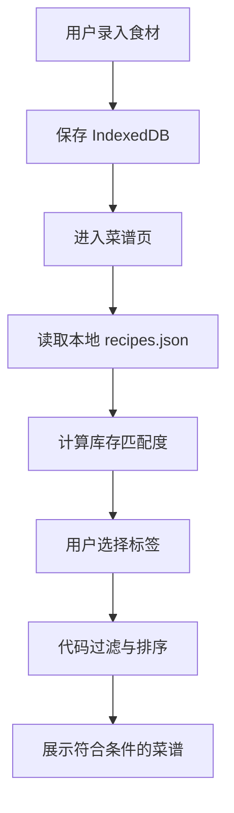
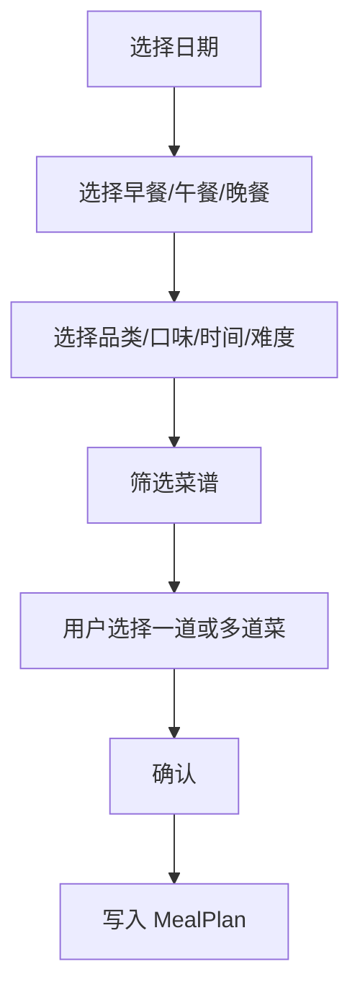
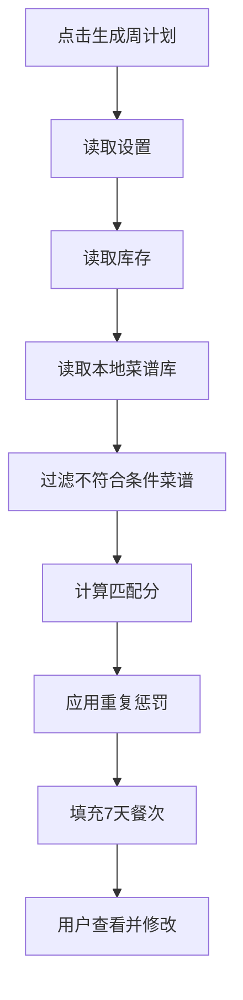
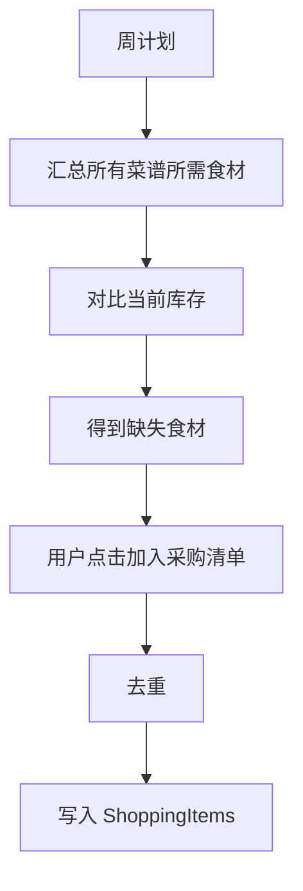

# AI家庭食材菜谱助手｜PRD V1.2-Solo MVP

**版本**：V1.2-Solo MVP  
**定位**：7–10 天单人可完成的无 AI 家庭食材 / 菜谱 / 饮食计划 / 采购助手  
**开发者前提**：1 人、无代码基础、使用 AI Coding 辅助开发  
**产品运行原则**：产品本身不调用任何 AI 模型、不使用 Dify、不需要模型 API Key、不产生 Token 成本  
**推荐开发周期**：7–10 天  
**建议投入**：每天约 4–6 小时  
**产品形态**：移动端优先的 PWA Web App，可添加至手机主屏幕或电脑桌面  
**数据策略**：Local-First，本地 IndexedDB 持久化，关闭页面或刷新后数据不丢失

---

# 0. 本次版本调整结论

V1.2-Solo 不再追求“AI 家庭厨房助手”，而是优先在 7–10 天内做成一个真正能使用的产品。

产品核心由：

> AI 识别 + AI 推荐 + AI 问答

调整为：

> **食材库存 + 本地菜谱库 + 规则筛选 + 饮食计划 + 采购清单**

本版本主动删除高风险、高调试成本模块，并新增用户高频、无需 AI 即可实现的功能。

## 0.1 本版本删除的功能

以下功能从当前 MVP 中移除：

1. AI 图片识别食材；
2. AI 厨房自由问答；
3. AI 自动生成菜谱；
4. AI 个性化推荐；
5. Dify Workflow；
6. Dify Chatflow；
7. Qwen / Qwen-VL API；
8. Serverless AI Proxy；
9. AI Recipe JSON 格式校验；
10. AI 生成失败重试；
11. Token 成本控制；
12. AI 推荐缓存；
13. 依赖模型输出的过敏 Validator。

这样可以显著降低开发复杂度、网络依赖、API 成本、调试成本和结果不稳定风险。

## 0.2 本版本新增的核心能力

### 1. 本地菜谱库
所有菜谱为结构化静态数据。用户选择条件后，系统通过代码筛选菜谱，不调用任何 AI。

### 2. 饮食计划
支持：
- 计划某一天；
- 计划某一天的早餐 / 午餐 / 晚餐；
- 一键生成一日计划；
- 一键生成周计划；
- 一顿饭添加多道菜；
- 用户自己挑选菜品；
- 根据现有库存优先展示更容易制作的菜；
- 根据品类、口味、时长、难度等标签筛选。

### 3. 采购清单
支持：
- 手动添加采购项；
- 从已有食材快速加入采购清单；
- 从饮食计划缺少的食材加入采购清单；
- 勾选已购买；
- 已完成项目变灰；
- 已完成数量 / 总数量统计；
- 进度条；
- 一键清空；
- 编辑数量和单位。

---

# 1. 产品定位

> 一个帮助家庭用户记录“家里有什么”、快速找到“能做什么”、提前安排“哪天吃什么”，并整理“还要买什么”的轻量家庭厨房助手。

核心闭环：

```text
家里有什么
    ↓
现有食材能做什么
    ↓
今天 / 这周准备吃什么
    ↓
还缺什么
    ↓
形成采购清单
    ↓
买完以后继续更新库存
```

---

# 2. MVP 核心目标

V1.2 必须实现：

1. 食材库存新增、编辑、删除；
2. 关闭页面后食材数据不丢失；
3. 自动显示食材新鲜度；
4. 食材可标记为已用完或丢弃；
5. 内置可筛选的本地菜谱库；
6. 根据用户现有食材计算菜谱匹配度；
7. 支持按品类、口味、时长、难度筛选菜谱；
8. 支持查看完整菜谱详情；
9. 支持收藏菜谱；
10. 支持制定单餐计划；
11. 支持制定日计划；
12. 支持一键生成周计划；
13. 一顿饭可加入多道菜；
14. 支持采购清单；
15. 采购完成项变灰；
16. 采购清单展示完成进度；
17. 支持一键清空采购清单；
18. 支持从饮食计划补充缺少食材；
19. 支持 PWA 安装；
20. 手机端使用流畅。

---

# 3. 7–10 天版本的范围控制

为了确保一个无代码基础的人能够完成，本版本明确不做：

- 用户登录；
- 云同步；
- 多设备同步；
- 图片上传和图片管理；
- 自动视觉识别；
- AI；
- 多人家庭协作；
- 营养摄入计算；
- 卡路里计算；
- 商城价格；
- 在线采购；
- 地图附近超市；
- 菜谱视频；
- 社区；
- 评论；
- 菜谱上传；
- 后台 CMS；
- 推荐模型。

---

# 4. 产品信息架构

底部采用 5 Tab：

```text
食材 | 菜谱 | 计划 | 采购 | 我的
```

| Tab | 用户问题 |
|---|---|
| 食材 | 我家里有什么？ |
| 菜谱 | 我现在能做什么？ |
| 计划 | 今天 / 这周吃什么？ |
| 采购 | 我还要买什么？ |
| 我的 | 我收藏了什么、有什么饮食偏好？ |

---

# 5. Tab1：食材

## 5.1 页面目标
让用户快速查看当前库存和食材状态。

## 5.2 顶部概览

展示：

```text
我的食材

12 种食材
2 种临期
1 种预计已过期
```

快捷按钮：

```text
[ + 添加食材 ]
```

## 5.3 食材筛选

- 全部；
- 新鲜；
- 尽快食用；
- 临期；
- 预计已过期。

## 5.4 食材卡片

展示：
- 固定图标 / Emoji；
- 食材名；
- 数量；
- 单位；
- 入库日期；
- 预计剩余天数；
- 新鲜度；
- 更多操作按钮。

示例：

```text
🍅 番茄                ⋮
2 个
预计剩余 1 天
[临期]
```

## 5.5 食材操作

更多菜单：

```text
编辑
加入采购清单
标记已用完
标记丢弃
删除
```

## 5.6 新增食材

取消 AI 拍照识别，采用：

### 方式 A：快速选择
从预设食材库搜索后设置数量。

### 方式 B：手动输入
填写：
- 名称；
- 数量；
- 单位；
- 入库时间；
- 储存方式。

## 5.7 食材字段

```ts
interface Ingredient {
  id: string;
  name: string;
  normalizedName: string;
  quantity: number;
  unit: string;
  storage: "fridge" | "freezer" | "room";
  addedAt: string;
  shelfLifeDays: number;
  customExpireAt?: string | null;
  status: "active" | "consumed" | "discarded";
  createdAt: string;
  updatedAt: string;
}
```

---

# 6. 新鲜度计算

```text
预计到期日 = 入库日期 + 参考保质期
剩余天数 = 预计到期日 - 当前日期
```

| 状态 | 条件 | 颜色 |
|---|---|---|
| 新鲜 | > 5 天 | 绿 |
| 尽快食用 | 3–5 天 | 黄 |
| 临期 | 1–2 天 | 橙 |
| 预计已过期 | ≤ 0 天 | 红 |

统一文案：

> 预计剩余 X 天

---

# 7. Tab2：菜谱

## 7.1 页面目标

无需 AI，通过结构化菜谱库帮助用户找到：

> “根据我现在已有的东西，可以做什么？”

---

# 8. 本地菜谱库

## 8.1 MVP 菜谱数量

- 7 天版本：50–60 道；
- 10 天版本：80–100 道。

不建议第一版录入 300+ 道菜。

## 8.2 菜谱覆盖方向

尽量覆盖：

### 早餐
鸡蛋类、面包、牛奶、粥、面、简易饮品。

### 中式正餐
荤菜、素菜、汤羹、主食、快手菜。

### 西式
意面、三明治、沙拉、煎类。

### 甜点
简易家庭甜品。

### 饮品
牛奶类、水果饮品、茶饮类。

## 8.3 菜谱标签

### 品类
```text
中式
西式
汤羹
甜点
饮品
主食
```

### 餐次
```text
早餐
午餐
晚餐
不限
```

### 口味
```text
清淡
咸鲜
香辣
酸甜
甜味
浓郁
清爽
```

### 烹饪时间
```text
≤15分钟
16–30分钟
31–60分钟
>60分钟
```

### 难度
```text
简单
普通
进阶
```

## 8.4 Recipe 数据结构

```ts
interface Recipe {
  id: string;
  title: string;
  category: "中式" | "西式" | "汤羹" | "甜点" | "饮品" | "主食";
  mealTypes: string[];
  flavors: string[];
  cookTimeMinutes: number;
  difficulty: "简单" | "普通" | "进阶";
  servings: number;
  ingredients: RecipeIngredient[];
  steps: string[];
  tips?: string[];
  image?: string;
}
```

## 8.5 菜谱食材结构

```ts
interface RecipeIngredient {
  name: string;
  normalizedName: string;
  amount: string;
  required: boolean;
}
```

## 8.6 菜谱示例

```json
{
  "id": "recipe_tomato_egg",
  "title": "番茄炒蛋",
  "category": "中式",
  "mealTypes": ["午餐", "晚餐"],
  "flavors": ["咸鲜", "酸甜"],
  "cookTimeMinutes": 15,
  "difficulty": "简单",
  "servings": 2,
  "ingredients": [
    {
      "name": "番茄",
      "normalizedName": "番茄",
      "amount": "2个",
      "required": true
    },
    {
      "name": "鸡蛋",
      "normalizedName": "鸡蛋",
      "amount": "3个",
      "required": true
    },
    {
      "name": "盐",
      "normalizedName": "盐",
      "amount": "适量",
      "required": false
    }
  ],
  "steps": [
    "番茄洗净切块。",
    "鸡蛋打散。",
    "先将鸡蛋炒熟盛出。",
    "加入番茄翻炒，再加入鸡蛋。",
    "调味后出锅。"
  ]
}
```

---

# 9. 菜谱筛选

页面顶部：

```text
[品类]
[口味]
[时间]
[难度]
[库存匹配]
```

## 9.1 库存匹配模式

### 模式 A：库存优先
默认。允许菜谱缺少少量食材。

### 模式 B：只看可以直接做
只显示所有必需食材都存在于当前库存的菜谱。

---

# 10. 菜谱匹配算法

无需 AI。

```text
ingredientCoverage
=
已有必需食材数
/
菜谱必需食材总数
```

基础排序分：

```text
score
=
ingredientCoverage × 80
+
expiringIngredientCount × 10
+
favoriteBonus
```

其中：

```text
favoriteBonus = 5
```

默认展示顺序：

1. 可以直接做；
2. 使用临期食材；
3. 只缺 1 种主要食材；
4. 只缺 2 种；
5. 其他。

---

# 11. 菜谱卡片

示例：

```text
番茄炒蛋

中式 · 咸鲜
15 分钟 · 简单

库存匹配 100%
✓ 番茄
✓ 鸡蛋

[查看菜谱]   [♡]
```

如果缺食材：

```text
库存匹配 67%

还缺：
青椒 × 2

[加入采购清单]
```

---

# 12. 菜谱详情

展示：

- 菜名；
- 分类；
- 口味；
- 时间；
- 难度；
- 份数；
- 所需食材；
- 已有食材；
- 缺少食材；
- 步骤；
- 小贴士；
- 收藏。

按钮：

```text
[加入饮食计划]
[将缺少食材加入采购清单]
```

---

# 13. Tab3：饮食计划

这是 V1.2 的核心新增模块。

## 13.1 计划类型

进入计划页提供：

```text
[计划一餐]
[生成一日计划]
[生成周计划]
```

---

# 14. 计划一餐

流程：

1. 选择日期；
2. 选择早餐 / 午餐 / 晚餐；
3. 选择筛选条件；
4. 展示符合条件的菜谱；
5. 用户可多选菜品；
6. 保存到对应餐次。

## 14.1 筛选条件

### 品类
多选：
```text
中式
西式
汤羹
甜点
饮品
主食
```

### 口味
多选：
```text
清淡
咸鲜
香辣
酸甜
甜味
浓郁
清爽
```

### 烹饪时间
```text
15分钟以内
30分钟以内
60分钟以内
不限
```

### 难度
```text
简单
普通
进阶
```

### 食材匹配方式
```text
库存优先
只看可以直接做
```

## 14.2 一顿饭多菜

用户可以：

```text
☑ 番茄炒蛋
☑ 紫菜蛋花汤
☑ 米饭
```

顶部显示：

```text
已选择 3 道
```

确认：

```text
[加入 8 月 18 日晚餐]
```

---

# 15. 一日计划

用户可以手动分别安排：

```text
早餐
午餐
晚餐
```

也可以点击：

```text
[一键生成今日计划]
```

## 15.1 默认每餐菜品数

```text
早餐：1 道
午餐：2 道
晚餐：2 道
```

用户可改为：

```text
1 / 2 / 3 道
```

---

# 16. 无 AI 一键生成日计划

规则：

```text
读取餐次
↓
过滤忌口/过敏
↓
过滤用户标签
↓
计算库存匹配度
↓
按分数排序
↓
取前 N 道
```

---

# 17. 周计划

周视图示例：

```text
8月17日 周一

早餐
燕麦牛奶

午餐
番茄炒蛋
紫菜汤

晚餐
土豆鸡块
炒青菜
```

## 17.1 一键生成周计划

用户选择：

### 要生成的餐次
```text
☑ 早餐
☑ 午餐
☑ 晚餐
```

### 每餐菜品数
```text
早餐：1
午餐：2
晚餐：2
```

### 筛选偏好
```text
品类
口味
最长烹饪时间
难度
库存匹配方式
```

点击：

```text
[生成本周计划]
```

---

# 18. 周计划生成算法

## Step 1：构建候选池

```text
过滤过敏
↓
过滤忌口
↓
过滤餐次
↓
过滤用户标签
↓
计算库存匹配度
```

## Step 2：排序

根据：

```text
库存覆盖率
临期食材
菜谱重复情况
```

## Step 3：减少重复

如果某菜在前 3 天已安排：

```text
score -= 30
```

同一天不重复。

## Step 4：填充

依次填入：

```text
周一 → 周日
```

## Step 5：生成缺失食材汇总

```text
菜谱所需食材
-
当前库存
=
本周缺少食材
```

用户可点击：

```text
[将缺少食材加入采购清单]
```

---

# 19. 计划编辑

用户可以：

- 删除某一道菜；
- 替换某一道菜；
- 向某顿饭继续添加菜；
- 清空某顿饭；
- 清空某一天；
- 清空整周。

---

# 20. 饮食计划数据结构

```ts
interface MealPlan {
  id: string;
  date: string;
  mealType: "breakfast" | "lunch" | "dinner";
  recipeIds: string[];
  createdAt: string;
  updatedAt: string;
}
```

---

# 21. Tab4：采购清单

页面顶部：

```text
采购清单

已完成 4 / 10

████████░░░░░░ 40%
```

列表：

```text
□ 番茄       4个
□ 鸡蛋       12个
✓ 牛奶       1盒
□ 土豆       3个
```

已完成项：

- 文字变灰；
- 可加删除线；
- 自动移动到底部。

---

# 22. 采购清单来源

## 来源 A：手动添加

输入：

- 名称；
- 数量；
- 单位。

## 来源 B：从食材库存加入

食材卡片：

```text
加入采购清单
```

## 来源 C：从菜谱 / 饮食计划加入

若菜谱缺：

```text
鸡胸肉
青椒
```

点击：

```text
将缺少食材加入采购清单
```

---

# 23. 采购清单去重

如果已有：

```text
鸡蛋 6个
```

再次加入：

```text
鸡蛋 4个
```

弹窗：

```text
采购清单里已经有“鸡蛋”。

[增加为 10 个]
[保留原数量]
```

如果单位不同，可保留为两条独立记录。

---

# 24. 勾选完成

```text
checked = true
```

UI：

- 变灰；
- 删除线；
- 自动更新进度。

再次点击可恢复。

---

# 25. 进度计算

```text
progress
=
checkedCount
/
totalCount
```

例如：

```text
4 / 10 = 40%
```

顶部展示：

```text
10 项
已完成 4 项
还剩 6 项
```

---

# 26. 一键清空

右上角：

```text
清空
```

二次确认：

```text
确定清空全部采购项吗？

取消 | 清空
```

若 10 天工期有余量，再增加：

```text
清除已完成
```

---

# 27. 采购清单数据结构

```ts
interface ShoppingItem {
  id: string;
  name: string;
  normalizedName: string;
  quantity: number;
  unit: string;
  checked: boolean;
  source: "manual" | "inventory" | "recipe" | "meal_plan";
  createdAt: string;
  updatedAt: string;
}
```

---

# 28. 推荐增加：采购完成后加入库存

这是一个成本低、闭环价值高的 P1 功能。

例如：

```text
✓ 鸡蛋 12个

[加入食材库存]
```

点击后：

```text
ShoppingItem
↓
创建 Ingredient
↓
入库日期 = 今天
```

---

# 29. Tab5：我的

本版本保持简单。

## 29.1 我的收藏
展示收藏菜谱。

## 29.2 饮食设置

- 过敏；
- 忌口。

为了 7–10 天开发稳定性，本版本统一直接排除。

## 29.3 默认偏好

保存：

- 常用口味；
- 最大烹饪时间；
- 常用难度；
- 默认人数。

## 29.4 数据管理

提供：

```text
清空饮食计划
清空采购清单
清空全部本地数据
```

---

# 30. 数据库存储

主数据库：

```text
IndexedDB
```

推荐：

```text
Dexie.js
```

表：

```text
ingredients
favorites
mealPlans
shoppingItems
settings
```

菜谱库建议作为静态资源：

```text
src/data/recipes.json
```

---

# 31. 为什么菜谱库用静态 JSON

优势：

1. 不需要后端；
2. 不需要数据库服务器；
3. 不需要联网；
4. 加载快；
5. 易于调试；
6. AI Coding 容易维护；
7. 7–10 天风险最低。

目录：

```text
src/
└── data/
    ├── recipes.json
    ├── ingredientMeta.json
    └── ingredientAliases.json
```

---

# 32. 食材别名

示例：

```json
{
  "西红柿": "番茄",
  "番茄": "番茄",
  "马铃薯": "土豆",
  "土豆": "土豆"
}
```

用于：

- 菜谱匹配；
- 采购去重；
- 库存匹配；
- 忌口过滤。

---

# 33. 计划与采购联动

核心链路：

```text
我的食材
↓
菜谱库筛选
↓
加入饮食计划
↓
系统识别缺少食材
↓
一键加入采购清单
↓
用户采购勾选
↓
采购完成
```

如果有时间，再增加：

```text
采购完成 → 加入库存
```

---

# 34. PWA

必须支持：

- manifest；
- App icon；
- standalone；
- Service Worker；
- HTTPS；
- 添加主屏幕；
- 本地数据持久化。

由于本版本不使用 AI，大多数功能均可离线：

```text
食材
菜谱
筛选
收藏
饮食计划
周计划
采购清单
设置
```

---

# 35. 推荐技术栈

```text
React
Vite
TypeScript
Tailwind CSS
Dexie.js
vite-plugin-pwa
```

不需要：

```text
Node 后端
数据库服务器
Dify
API
云函数
模型平台
```

部署只需要静态网站托管。

---

# 36. 页面结构

```text
src/
├── components/
│   ├── IngredientCard.tsx
│   ├── RecipeCard.tsx
│   ├── FilterBar.tsx
│   ├── MealSlot.tsx
│   ├── ShoppingItem.tsx
│   └── BottomNav.tsx
│
├── pages/
│   ├── IngredientsPage.tsx
│   ├── RecipesPage.tsx
│   ├── PlannerPage.tsx
│   ├── ShoppingPage.tsx
│   └── ProfilePage.tsx
│
├── data/
│   ├── recipes.json
│   ├── ingredientMeta.json
│   └── ingredientAliases.json
│
├── db/
│   └── db.ts
│
├── utils/
│   ├── freshness.ts
│   ├── recipeMatch.ts
│   ├── mealPlanner.ts
│   └── shopping.ts
│
└── App.tsx
```

---

# 37. 核心业务流程

## 37.1 库存到菜谱



## 37.2 单餐计划



## 37.3 周计划



## 37.4 周计划到采购



---

# 38. 7 天版本 P0

如果必须 7 天完成，只做：

### 食材
- 新增；
- 编辑；
- 删除；
- 新鲜度；
- 已用完；
- 加入采购。

### 菜谱
- 50 道；
- 筛选；
- 库存匹配；
- 收藏；
- 缺少食材。

### 计划
- 单餐计划；
- 日计划；
- 一键周计划；
- 一餐多菜。

### 采购
- 新增；
- 编辑；
- 勾选；
- 变灰；
- 进度；
- 清空；
- 从菜谱添加。

### 我的
- 收藏；
- 忌口 / 过敏；
- 默认偏好。

### 技术
- IndexedDB；
- PWA。

---

# 39. 10 天版本可增加

开发顺利后，第 8–10 天增加：

1. 80–100 道菜谱；
2. 从采购清单一键加入库存；
3. 清除已完成；
4. 周计划替换某道菜；
5. 更好的空状态；
6. PWA 安装提示；
7. 导出 / 导入本地数据；
8. 更完善的移动端视觉；
9. 更丰富的菜谱图片。

---

# 40. 7–10 天开发排期

## Day 1：项目骨架

目标：

```text
App 可以跑起来
5 Tab 可以切换
PWA 基础配置
```

完成：

- React/Vite/TypeScript；
- Tailwind；
- 底部导航；
- 5 个页面壳子；
- Dexie；
- Git 初始化。

---

## Day 2：食材库存

完成：

- Ingredient 数据结构；
- 添加；
- 编辑；
- 删除；
- 新鲜度；
- 过滤；
- 已用完；
- 丢弃；
- 刷新不丢数据。

验收：

> 可以真正把冰箱食材录进去。

---

## Day 3：菜谱库

完成：

- recipes.json；
- 先录入 30–50 道；
- RecipeCard；
- 分类标签；
- 口味标签；
- 时间；
- 难度；
- 详情页。

---

## Day 4：库存匹配

完成：

- normalizedName；
- recipeMatch；
- 库存覆盖率；
- “可以直接做”；
- “还缺什么”；
- 标签筛选；
- 收藏。

验收：

> 添加番茄和鸡蛋后，番茄炒蛋应该排在前面。

---

## Day 5：饮食计划

完成：

- 日期选择；
- 早餐 / 午餐 / 晚餐；
- 一顿多菜；
- 手动添加菜谱到计划；
- 删除计划菜；
- 日视图。

验收：

> 可以安排“周一晚餐 = 番茄炒蛋 + 紫菜汤”。

---

## Day 6：自动日 / 周计划

完成：

- mealPlanner；
- 一键日计划；
- 一键周计划；
- 基础重复惩罚；
- 周视图。

只要求：

```text
规则正确
结果可编辑
不会大量重复
```

---

## Day 7：采购清单

完成：

- 手动添加；
- 从库存添加；
- 从菜谱缺失食材添加；
- checkbox；
- 已完成变灰；
- 进度；
- 计数；
- 一键清空。

到 Day 7：

> 核心 MVP 应完整可用。

---

## Day 8：计划 → 采购联动

完成：

- 汇总周计划缺失食材；
- 一键加入采购；
- 去重；
- 数量编辑；
- 修 Bug。

---

## Day 9：PWA + 手机体验

完成：

- PWA 安装；
- App Icon；
- Safe Area；
- 页面滚动；
- Empty State；
- 视觉统一。

---

## Day 10：测试与作品集打磨

完成：

- 核心流程测试；
- 删除测试数据；
- 修复 Bug；
- 补菜谱；
- 截图；
- 准备产品演示；
- 部署正式 Demo。

---

# 41. 无代码基础开发策略

## 原则 1：一次只让 AI Coding 做一个功能

错误：

```text
帮我把整个家庭菜谱助手全部做完。
```

正确：

```text
现在只实现食材新增和 IndexedDB 保存，不要修改其他页面。
```

## 原则 2：每做完一个模块立即测试

```text
实现
↓
运行
↓
测试
↓
Git commit
↓
下一个功能
```

## 原则 3：第一天不要追求漂亮 UI

先：

```text
功能正确
```

再：

```text
视觉优化
```

## 原则 4：菜谱库先小后大

```text
10 道测试
↓
30 道
↓
50 道
↓
功能稳定
↓
再扩充
```

---

# 42. 关键测试用例

## 42.1 食材

| 场景 | 预期 |
|---|---|
| 添加番茄 | 列表立即出现 |
| 刷新 | 数据不丢 |
| 标记已用完 | 从 active 消失 |
| 加入采购 | 采购页出现番茄 |
| 临期 | 正确显示橙色 |

## 42.2 菜谱

| 场景 | 预期 |
|---|---|
| 库存有番茄+鸡蛋 | 番茄炒蛋高匹配 |
| 选择中式 | 只展示对应菜谱 |
| 选择15分钟 | 排除超时菜谱 |
| 选择简单 | 排除普通/进阶 |
| 缺青椒 | 明确显示缺少青椒 |

## 42.3 计划

| 场景 | 预期 |
|---|---|
| 计划某天晚餐 | 正确写入 |
| 一餐选3道 | 可正常保存 |
| 删除其中一道 | 其他菜保留 |
| 一键周计划 | 生成7天 |
| 同一菜 | 不应连续大量重复 |

## 42.4 采购

| 场景 | 预期 |
|---|---|
| 手动加鸡蛋 | 出现 |
| 勾选 | 变灰 |
| 取消勾选 | 恢复 |
| 4/10完成 | 进度40% |
| 清空 | 二次确认后全删 |
| 从菜谱添加缺失食材 | 正确加入 |

---

# 43. MVP 验收核心流程

最终必须连续跑通：

```text
1. 用户添加：
番茄
鸡蛋
土豆

↓

2. 菜谱页自动显示：
番茄炒蛋：匹配100%
土豆丝：匹配100%
青椒炒肉：还缺青椒和猪肉

↓

3. 用户筛选：
中式
30分钟
简单

↓

4. 用户将：
番茄炒蛋
紫菜蛋花汤

加入周一晚餐

↓

5. 用户一键生成本周计划

↓

6. 系统汇总本周缺少食材

↓

7. 用户一键加入采购清单

↓

8. 采购：
□ 青椒
□ 猪肉
□ 牛奶

↓

9. 买到牛奶后勾选：

✓ 牛奶

进度：
1 / 3
33%

↓

10. 页面关闭后再打开

所有数据仍存在
```

只要这条流程稳定跑通：

> V1.2 就已经是一个完整可展示、可使用的 MVP。

---

# 44. 产品价值总结

V1.2 不依赖 AI，却形成完整的家庭厨房闭环：

```text
库存管理
    ↓
菜谱匹配
    ↓
饮食计划
    ↓
采购缺口
    ↓
采购清单
    ↓
重新入库
```

优势：

1. 数据完全在本地；
2. 不需要 API；
3. 没有模型成本；
4. 响应速度快；
5. 结果稳定；
6. 可离线使用；
7. 一人可以维护；
8. 7–10 天可实现；
9. 后续仍可重新加入 AI。

---

# 45. 后续升级空间

未来可重新增加：

```text
V1.3
AI 食材识别

V1.4
AI 菜谱自然语言搜索

V1.5
AI 自动周计划优化

V1.6
AI 根据剩余食材推荐替代菜谱
```

当前数据结构：

```text
Recipe
Ingredient
MealPlan
ShoppingItem
Settings
```

都可以继续复用，不需要推翻重做。

---

# 46. 最终产品一句话

> **一个根据家庭现有食材筛选菜谱、安排每日/每周饮食，并自动整理采购需求的本地优先家庭厨房助手。**

---

**文档状态：V1.2-Solo MVP，可直接进入 7–10 天开发阶段。**
