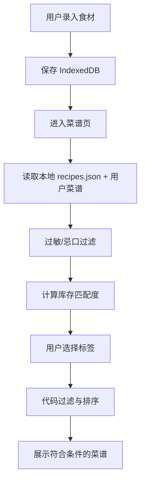
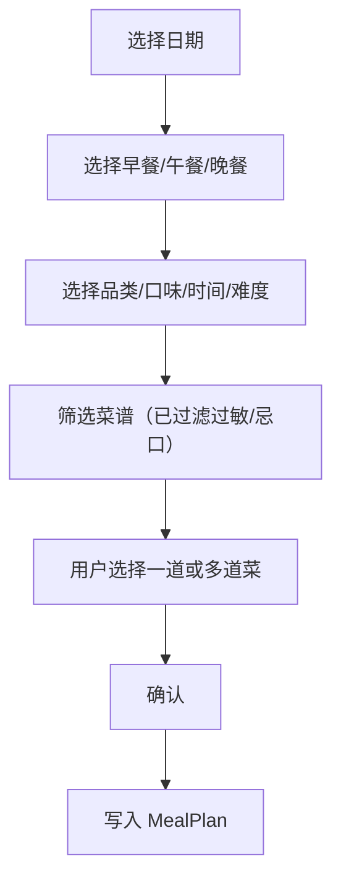
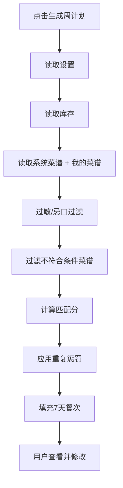
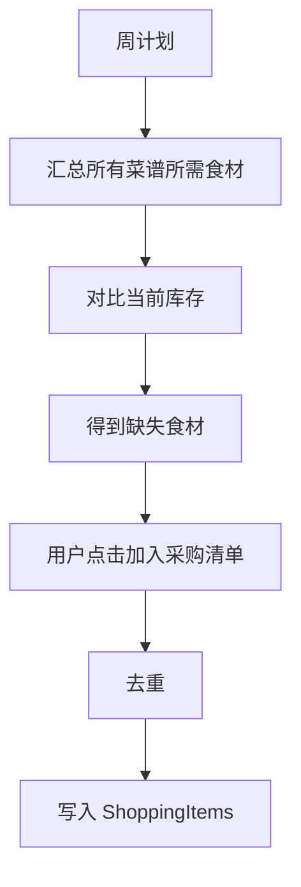

# AI家庭食材菜谱助手｜PRD V1.3-Solo MVP

**版本**：V1.3-Solo MVP
**定位**：7–10 天单人可完成的无 AI 家庭食材 / 菜谱 / 饮食计划 / 采购助手
**开发者前提**：1 人、无代码基础、使用 AI Coding 辅助开发
**产品运行原则**：产品本身不调用任何 AI 模型、不使用 Dify、不需要模型 API Key、不产生 Token 成本
**推荐开发周期**：7–10 天
**建议投入**：每天约 4–6 小时
**产品形态**：移动端优先的 PWA Web App，可添加至手机主屏幕或电脑桌面
**数据策略**：Local-First，本地 IndexedDB 持久化，关闭页面或刷新后数据不丢失

---

# 0. 本次版本调整结论（V1.3 相对 V1.2 的升级）

V1.3 在 V1.2 的基础上，吸收数据架构设计规范，将产品从"固定菜谱库 + 固定食材库"升级为 **"内置基础库 + 用户自定义数据 + 本地持久化 + 规则过滤"** 的完整本地优先工具。

## 0.1 V1.3 新增的核心能力

| 新增模块 | 说明 |
|---|---|
| **食材字典** | 系统内置预设食材列表，用于搜索自动补全、标签、过敏原匹配 |
| **我的菜谱** | 用户可上传自定义菜谱，保存到本地 IndexedDB，与系统菜谱并列展示 |
| **三层菜谱体系** | 系统菜谱 + 我的菜谱 + 用户当前库存，三者联动参与规则筛选 |
| **过敏强制排除** | 用户设置过敏食材后，含该食材的菜谱直接隐藏，并提示原因 |
| **忌口默认隐藏** | 用户设置忌口食材后，含该食材的菜谱默认不展示（优先级低于过敏） |
| **食材别名表** | 解决名称不一致问题（如"花生米"→"花生"），提高匹配准确率 |
| **数据导入/导出** | 用户可一键导出全部数据为 JSON 文件，也可导入恢复，解决本地数据备份问题 |
| **菜谱图片本地存储** | 用户上传菜谱时可配图，图片以 Blob 形式保存在 IndexedDB 中 |

## 0.2 本版本沿用 V1.2 的删除项

以下功能继续不纳入本版本：

1. AI 图片识别食材；
2. AI 厨房自由问答；
3. AI 自动生成菜谱；
4. AI 个性化推荐；
5. Dify Workflow / Chatflow；
6. Qwen / Qwen-VL API；
7. Serverless AI Proxy；
8. AI Recipe JSON 格式校验；
9. AI 生成失败重试；
10. Token 成本控制；
11. AI 推荐缓存；
12. 依赖模型输出的过敏 Validator；
13. 用户登录 / 云同步 / 多设备同步；
14. 营养/卡路里计算；
15. 社区/评论/菜谱分享；
16. 商城价格/在线采购。

---

# 1. 产品定位

> 一个帮助家庭用户记录"家里有什么"、快速找到"能做什么"、提前安排"哪天吃什么"，并整理"还要买什么"的轻量家庭厨房助手。

**V1.3 的独特价值：**

- 用户数据完全保存在本地，不上传任何服务器；
- 用户可以上传自己的菜谱，形成个人菜谱资产；
- 过敏/忌口规则保障饮食安全；
- 数据可导出备份，不锁定用户数据。

**核心闭环：**

```text
家里有什么（我的食材）
         ↓
   现有食材能做什么
         ↓
今天 / 这周准备吃什么（饮食计划）
         ↓
         还缺什么
         ↓
    形成采购清单
         ↓
  买完以后继续更新库存
```

---

# 2. MVP 核心目标

V1.3 必须实现：

1. 食材库存新增、编辑、删除，关闭页面后数据不丢失；
2. 自动显示食材新鲜度（绿/黄/橙/红）；
3. 食材可标记为已用完或丢弃；
4. 内置 50–80 道系统菜谱；
5. 用户可自定义上传菜谱（我的菜谱）；
6. 菜谱列表区分 [全部] [系统菜谱] [我的菜谱]；
7. 根据用户现有食材计算菜谱匹配度；
8. 支持按品类、口味、时长、难度筛选菜谱；
9. 支持查看完整菜谱详情；
10. 支持收藏菜谱；
11. 过敏食材强制排除（含过敏食材的菜谱不展示）；
12. 忌口食材默认隐藏（含忌口食材的菜谱默认不展示）；
13. 支持制定单餐计划；
14. 支持制定日计划；
15. 支持一键生成周计划；
16. 一顿饭可加入多道菜；
17. 支持采购清单（手动添加/从库存添加/从计划添加）；
18. 采购完成项变灰，展示完成进度；
19. 支持一键清空采购清单；
20. 支持数据导出为 JSON 文件；
21. 支持从 JSON 文件导入恢复数据；
22. 支持 PWA 安装；
23. 手机端使用流畅。

---

# 3. 7–10 天版本的范围控制

本版本明确不做：

- 用户登录 / 注册；
- 云同步 / 多设备同步；
- 图片上传到服务器（图片仅本地 Blob 存储）；
- 自动视觉识别；
- AI 任何能力；
- 多人家庭协作；
- 营养摄入 / 卡路里计算；
- 商城价格 / 在线采购；
- 地图 / 附近超市；
- 菜谱视频；
- 社区 / 评论；
- 后台 CMS；
- 推荐模型。

---

# 4. 产品信息架构

底部采用 5 Tab：

```text
食材 | 菜谱 | 计划 | 采购 | 我的
```

| Tab | 用户问题 |
|---|---|
| 食材 | 我家里有什么？ |
| 菜谱 | 我现在能做什么？ |
| 计划 | 今天 / 这周吃什么？ |
| 采购 | 我还要买什么？ |
| 我的 | 我收藏了什么、有什么饮食偏好、我的自定义菜谱 |

---

# 5. 核心架构设计（V1.3 关键设计）

## 5.1 设计原则

本产品采用 **"内置基础库 + 用户自定义数据 + 本地持久化 + 规则过滤"** 的四层架构，避免将菜谱库与食材库设计为需人工维护的固定大型数据库。该架构适用于单人开发、7–10 天交付的 MVP 阶段，同时可支持用户忌口、过敏及自定义菜谱等个性化需求。

## 5.2 系统基础数据 vs 用户数据

```text
                  系统基础数据
                       │
            ┌──────────┴──────────┐
            ↓                     ↓
        基础菜谱库              食材字典
         (内置JSON)            (内置JSON)
            │                     │
            │                     │
            ↓                     ↓
       用户可使用菜谱          用户添加食材
            ↑
            │
       用户自定义菜谱
         (IndexedDB)
```

用户数据包含以下三类，全部持久化存储于用户本地：

```text
              用户数据
                 │
     ┌───────────┼────────────┐
     ↓           ↓            ↓
 我的食材     我的菜谱      饮食偏好
                              │
                       过敏 / 忌口
```

## 5.3 数据分层总览

| 数据类型 | 来源 | 保存位置 | 是否可编辑 |
|---|---|---|---|
| 基础菜谱库 | 系统预置 50–80 道 | App 内置 JSON | 否（仅开发者可更新） |
| 食材字典 | 系统预置 | App 内置 JSON | 否（仅开发者可更新） |
| 食材别名表 | 系统预置 | App 内置 JSON | 否（仅开发者可更新） |
| 我的食材 | 用户添加 | IndexedDB | 是 |
| 我的菜谱 | 用户上传 | IndexedDB | 是（增删改） |
| 收藏 | 用户操作 | IndexedDB | 是 |
| 饮食偏好（过敏/忌口） | 用户设置 | IndexedDB | 是 |
| 饮食计划 | 用户生成/编辑 | IndexedDB | 是 |
| 采购清单 | 用户生成/编辑 | IndexedDB | 是 |

## 5.4 三层菜谱体系

产品菜谱体系分为三个层级，三者联动参与规则筛选与排序：

| 层级 | 内容 | 来源 | 存储位置 |
|---|---|---|---|
| 第一层：系统菜谱 | 预置 50–80 道基础菜谱 | 开发者预置 | App 内置 |
| 第二层：用户菜谱 | 用户自定义上传的菜谱 | 用户上传 | IndexedDB |
| 第三层：用户当前库存 | 用户持有的食材 | 用户添加 | IndexedDB |

系统根据 **系统菜谱 + 我的菜谱 + 我的食材 + 饮食偏好** 进行规则筛选与排序，输出菜谱推荐结果。

---

# 6. 食材字典（新增）

## 6.1 什么是食材字典

系统内置的预设食材列表，用于：

- 添加食材时的搜索和自动补全；
- 标准化标签；
- 过敏/忌口食材选择；
- 菜谱食材匹配；
- 采购清单去重。

## 6.2 食材字典示例

```json
[
  { "id": "ing_001", "name": "番茄", "emoji": "🍅", "defaultUnit": "个", "shelfLifeDays": 7 },
  { "id": "ing_002", "name": "鸡蛋", "emoji": "🥚", "defaultUnit": "个", "shelfLifeDays": 21 },
  { "id": "ing_003", "name": "牛奶", "emoji": "🥛", "defaultUnit": "盒", "shelfLifeDays": 7 },
  { "id": "ing_004", "name": "土豆", "emoji": "🥔", "defaultUnit": "个", "shelfLifeDays": 30 },
  { "id": "ing_005", "name": "花生", "emoji": "🥜", "defaultUnit": "克", "shelfLifeDays": 90 }
]
```

## 6.3 食材字典与"我的食材"的关系

```text
食材字典（系统内置）
         ↓
用户搜索"番茄"
         ↓
从字典中选择"番茄"
         ↓
设置数量、单位、入库日期
         ↓
保存到"我的食材"（IndexedDB）
```

**关键区别：**

- 食材字典是系统预设的静态数据，用户不能修改；
- "我的食材"是用户自己的库存数据，保存在 IndexedDB 中。

---

# 7. 食材别名表（新增）

## 7.1 为什么需要别名表

用户输入的食材名称可能与菜谱/字典中的标准名称不一致。例如：

```text
用户设置过敏：花生
菜谱配料写：花生米
```

如果只做字符串完全匹配：

```text
"花生" == "花生米" → false ❌
```

结果就是过敏判断失效。

## 7.2 别名表示例

```json
{
  "花生": ["花生", "花生米", "炒花生", "花生仁"],
  "牛奶": ["牛奶", "鲜奶", "纯牛奶"],
  "鸡蛋": ["鸡蛋", "蛋", "鸡子"],
  "番茄": ["番茄", "西红柿", "洋柿子"],
  "土豆": ["土豆", "马铃薯", "洋芋"],
  "香菜": ["香菜", "芫荽"],
  "青椒": ["青椒", "甜椒", "菜椒", "灯笼椒"]
}
```

## 7.3 使用方式

```text
用户输入/菜谱食材
         ↓
  查询别名表
         ↓
  映射到标准食材名
         ↓
  用标准名进行匹配
```

例如：

```text
花生米 → 标准名称：花生
```

该方案可覆盖 MVP 阶段绝大多数场景。

---

# 8. Tab1：食材

## 8.1 页面目标

让用户快速查看当前库存和食材状态。

## 8.2 顶部概览

展示：

```text
我的食材
12 种食材
2 种临期
1 种预计已过期
```

快捷按钮：

```text
[ + 添加食材 ]
```

## 8.3 食材筛选

- 全部；
- 新鲜；
- 尽快食用；
- 临期；
- 预计已过期。

## 8.4 食材卡片

展示：

- Emoji；
- 食材名；
- 数量；
- 单位；
- 入库日期；
- 预计剩余天数；
- 新鲜度状态标签；
- 更多操作按钮（⋮）。

示例：

```text
🍅 番茄                ⋮
2 个
预计剩余 1 天
[临期]
```

## 8.5 食材操作

更多菜单：

```text
编辑
加入采购清单
标记已用完
标记丢弃
删除
```

## 8.6 新增食材

### 方式 A：从食材字典快速选择（优先）

1. 输入食材名 → 自动补全匹配食材字典；
2. 选择后自动填充默认单位；
3. 用户设置数量和入库日期；
4. 保存到"我的食材"。

### 方式 B：手动输入

当食材字典中不存在时，用户可手动输入：

- 名称；
- 数量；
- 单位；
- 入库日期；
- 储存方式。

## 8.7 食材字段

```ts
interface Ingredient {
  id: string;
  name: string;
  normalizedName: string;      // 标准化名称，用于匹配
  quantity: number;
  unit: string;
  storage: "fridge" | "freezer" | "room";
  addedAt: string;             // 入库日期
  shelfLifeDays: number;       // 参考保质期（天）
  customExpireAt?: string | null;
  status: "active" | "consumed" | "discarded";
  createdAt: string;
  updatedAt: string;
}
```

---

# 9. 新鲜度计算

```text
预计到期日 = 入库日期 + 参考保质期
剩余天数 = 预计到期日 - 当前日期
```

| 状态 | 条件 | 颜色 | 标签 |
|---|---|---|---|
| 新鲜 | > 5 天 | 绿 | 新鲜 |
| 尽快食用 | 3–5 天 | 黄 | 尽快食用 |
| 临期 | 1–2 天 | 橙 | 临期 |
| 预计已过期 | ≤ 0 天 | 红 | 已过期 |

统一文案：

> 预计剩余 X 天

---

# 10. Tab2：菜谱

## 10.1 页面目标

无需 AI，通过结构化菜谱库帮助用户找到：

> "根据我现在已有的东西，可以做什么？"

## 10.2 菜谱来源切换（三层菜谱体系）

页面顶部增加 Tab 切换：

```text
[全部] [系统菜谱] [我的菜谱]
```

- **全部**：系统菜谱 + 我的菜谱 合并展示；
- **系统菜谱**：仅展示内置菜谱；
- **我的菜谱**：仅展示用户自定义菜谱。

## 10.3 菜谱筛选

```text
[品类] [口味] [时间] [难度] [库存匹配]
```

| 筛选项 | 选项 |
|---|---|
| 品类 | 中式、西式、汤羹、甜点、饮品、主食 |
| 口味 | 清淡、咸鲜、香辣、酸甜、甜味、浓郁、清爽 |
| 烹饪时间 | ≤15分钟、16–30分钟、31–60分钟、>60分钟 |
| 难度 | 简单、普通、进阶 |
| 库存匹配模式 | 库存优先（默认）/ 只看可以直接做 |

## 10.4 库存匹配模式

### 模式 A：库存优先（默认）

允许菜谱缺少少量食材，按匹配度排序。

### 模式 B：只看可以直接做

只显示所有必需食材都存在于当前库存的菜谱。

---

# 11. 系统基础菜谱库

## 11.1 菜谱数量

- 7 天版本：50–60 道；
- 10 天版本：80–100 道。

**原则：先小后大。** 先录入 10 道测试，功能稳定后再扩充。

## 11.2 菜谱覆盖方向

- 早餐：鸡蛋类、面包、牛奶、粥、面、简易饮品；
- 中式正餐：荤菜、素菜、汤羹、主食、快手菜；
- 西式：意面、三明治、沙拉、煎类；
- 甜点：简易家庭甜品；
- 饮品：牛奶类、水果饮品、茶饮类。

## 11.3 Recipe 数据结构

```ts
interface Recipe {
  id: string;
  title: string;
  category: "中式" | "西式" | "汤羹" | "甜点" | "饮品" | "主食";
  mealTypes: string[];          // ["早餐", "午餐", "晚餐"]
  flavors: string[];            // ["咸鲜", "酸甜"]
  cookTimeMinutes: number;
  difficulty: "简单" | "普通" | "进阶";
  servings: number;
  ingredients: RecipeIngredient[];
  steps: string[];
  tips?: string[];
  image?: string;               // 系统菜谱可选配图
  isSystem: true;               // 标记为系统菜谱
  allergens?: string[];         // 标注食材中的常见过敏原
}
```

## 11.4 菜谱食材结构

```ts
interface RecipeIngredient {
  name: string;                 // 显示名称
  normalizedName: string;       // 标准化名称，用于匹配
  amount: string;               // "2个" / "150克" / "适量"
  required: boolean;            // 是否必需
}
```

## 11.5 菜谱示例

```json
{
  "id": "recipe_tomato_egg",
  "title": "番茄炒蛋",
  "category": "中式",
  "mealTypes": ["午餐", "晚餐"],
  "flavors": ["咸鲜", "酸甜"],
  "cookTimeMinutes": 15,
  "difficulty": "简单",
  "servings": 2,
  "ingredients": [
    { "name": "番茄", "normalizedName": "番茄", "amount": "2个", "required": true },
    { "name": "鸡蛋", "normalizedName": "鸡蛋", "amount": "3个", "required": true },
    { "name": "盐", "normalizedName": "盐", "amount": "适量", "required": false }
  ],
  "steps": ["番茄切块", "鸡蛋打散", "先炒鸡蛋", "加入番茄翻炒", "调味出锅"],
  "isSystem": true,
  "allergens": ["鸡蛋"]
}
```

---

# 12. 用户自定义菜谱（新增核心功能）

## 12.1 入口

```text
我的 → 我的菜谱 → [+ 上传菜谱]
```

## 12.2 上传流程

### 第一步：基本信息

```text
菜名（必填）
图片（可选，用户上传）
分类（单选）：中式 | 西式 | 汤羹 | 甜点 | 饮品 | 主食
口味（多选）：清淡 | 咸鲜 | 香辣 | 酸甜 | 甜味 | 浓郁 | 清爽
难度（单选）：简单 | 普通 | 进阶
烹饪时间（分钟）
份数
```

### 第二步：添加食材

逐条添加：

```text
食材名称（搜索/从食材字典选择）
数量
单位
[添加]
```

已添加列表展示，每条可删除。

### 第三步：添加步骤

```text
步骤描述
[添加步骤]
```

已添加步骤列表展示，每条可删除（第一版可省略排序）。

### 第四步：保存

```text
[保存菜谱]
```

保存到 IndexedDB 的 recipes 表（标记 `isSystem: false`），保存后跳转到"我的菜谱"列表。

## 12.3 用户菜谱数据结构

```ts
interface UserRecipe extends Recipe {
  isSystem: false;              // 标记为用户菜谱
  imageBlob?: Blob;             // 用户上传的图片，保存为 Blob
  createdAt: string;
  updatedAt: string;
}
```

## 12.4 用户菜谱的编辑与删除

- 在我的菜谱列表中，每个菜谱卡片提供 [编辑] [删除] 按钮；
- 编辑时加载原有数据，修改后重新保存；
- 删除时二次确认。

---

# 13. 过敏/忌口过滤（新增核心功能）

## 13.1 概念区分

| | 过敏 | 忌口 |
|---|---|---|
| 定义 | 食用后可能危害健康 | 个人口味偏好/习惯 |
| 处理方式 | 强制排除 | 默认隐藏 |
| 用户提示 | "已隐藏 X 道含过敏食材的菜谱" | 不提示 |
| 优先级 | 最高（先于所有筛选） | 次高（过敏过滤之后） |

## 13.2 基于食材明细的过滤逻辑

过敏与忌口过滤不得仅依据菜谱名称进行判断，必须检查菜谱的完整食材明细（`ingredients`）。

**示例场景：** 用户设置"花生过敏"，菜谱"宫保鸡丁"名称中不含"花生"，但其食材明细包含花生，因此该菜谱应被排除。

## 13.3 过敏处理逻辑

```text
用户设置：花生过敏
         ↓
系统检查所有菜谱的 ingredients（含别名匹配）
         ↓
菜谱含有"花生"或别名 → 直接排除
         ↓
不展示该菜谱
         ↓
列表底部提示："已隐藏 X 道含过敏食材的菜谱"
```

## 13.4 忌口处理逻辑

```text
用户设置：不吃香菜
         ↓
系统检查所有菜谱的 ingredients
         ↓
菜谱含有"香菜"或别名 → 默认不展示
         ↓
（第一版不提供"显示忌口菜谱"开关）
```

## 13.5 过滤执行顺序

```text
  所有菜谱
       ↓
  过敏过滤（强制排除）
       ↓
  忌口过滤（默认隐藏）
       ↓
  其他筛选条件（品类/口味/时间/难度）
       ↓
  库存匹配度计算
       ↓
  按匹配度排序展示
```

## 13.6 过敏免责声明

MVP 阶段的过敏原过滤基于菜谱中已登记的食材明细执行，不具备医学级识别能力。例如用户设置"牛奶过敏"，菜谱可能含有黄油、奶油、奶酪等乳制品而未被标注，存在漏判风险。

**产品文案规范：**

- 饮食设置页底部展示："根据菜谱中已登记的食材进行过滤，请结合实际配料自行确认。"
- 菜谱详情页（含用户过敏食材时）展示："⚠️ 此菜谱含有您的过敏食材，请谨慎确认。"

**禁止宣传：** 不得使用"保证无过敏原""医学级安全"等绝对化表述。

---

# 14. 菜谱匹配算法

## 14.1 匹配度计算

```text
ingredientCoverage
=
已有必需食材数 / 菜谱必需食材总数
```

## 14.2 排序分

```text
score =
ingredientCoverage × 80
+ expiringIngredientCount × 10
+ favoriteBonus (5)
```

## 14.3 默认展示顺序

1. 可以直接做（100% 覆盖）；
2. 使用临期食材；
3. 只缺 1 种主要食材；
4. 只缺 2 种；
5. 其他。

---

# 15. 菜谱卡片

## 15.1 完整匹配（100%）

```text
番茄炒蛋
中式 · 咸鲜
15 分钟 · 简单
库存匹配 100%
✓ 番茄
✓ 鸡蛋
[查看菜谱]   [♡]
```

## 15.2 部分匹配

```text
青椒炒肉
中式 · 香辣
20 分钟 · 普通
库存匹配 67%
还缺：
青椒 × 2
猪肉 × 150克
[加入采购清单]   [♡]
```

## 15.3 过敏隐藏（用户可见提示）

```text
（该菜谱因含有过敏食材"花生"已被隐藏）
```

---

# 16. 菜谱详情

展示：

- 菜名；
- 分类；
- 口味；
- 时间；
- 难度；
- 份数；
- 所需食材（区分已有/缺少）；
- 步骤；
- 小贴士；
- 收藏按钮；
- 如果是用户菜谱，显示编辑/删除按钮。

底部操作按钮：

```text
[加入饮食计划]
[将缺少食材加入采购清单]
```

**过敏/忌口标注：**

如果菜谱含有用户设置的过敏原，在详情页顶部显示醒目警告：

```text
⚠️ 此菜谱含有您的过敏食材：花生
```

---

# 17. Tab3：饮食计划

## 17.1 计划类型

进入计划页提供三个入口：

```text
[计划一餐] [生成一日计划] [生成周计划]
```

## 17.2 计划一餐

流程：

1. 选择日期；
2. 选择早餐/午餐/晚餐；
3. 选择筛选条件（品类、口味、时间、难度）；
4. 展示符合条件的菜谱（已过滤过敏/忌口）；
5. 用户可多选菜品；
6. 保存到对应餐次。

## 17.3 一顿饭多菜

用户可以：

```text
☑ 番茄炒蛋
☑ 紫菜蛋花汤
☑ 米饭
```

顶部显示：

```text
已选择 3 道
```

确认：

```text
[加入 8 月 18 日晚餐]
```

## 17.4 生成日计划

- 手动分别安排早餐/午餐/晚餐；
- 或点击 [一键生成今日计划]。

默认每餐菜品数：

```text
早餐：1 道
午餐：2 道
晚餐：2 道
```

用户可调整：1 / 2 / 3 道。

## 17.5 生成周计划

用户选择：

- 要生成的餐次（☑ 早餐 / ☑ 午餐 / ☑ 晚餐）；
- 每餐菜品数；
- 筛选偏好（品类、口味、最长烹饪时间、难度）。

点击：

```text
[生成本周计划]
```

## 17.6 周计划生成算法

### Step 1：构建候选池

```text
读取所有菜谱（系统 + 我的菜谱）
↓
过敏过滤（强制排除）
↓
忌口过滤（默认隐藏）
↓
过滤餐次
↓
过滤用户筛选条件
↓
计算库存匹配度
```

### Step 2：排序

根据：

- 库存覆盖率；
- 临期食材；
- 菜谱重复情况。

### Step 3：减少重复

如果某菜在前 3 天已安排：

```text
score -= 30
```

同一天不重复。

### Step 4：填充

依次填入周一 → 周日。

## 17.7 计划编辑

用户可以：

- 删除某一道菜；
- 替换某一道菜；
- 向某顿饭继续添加菜；
- 清空某顿饭；
- 清空某一天；
- 清空整周。

## 17.8 饮食计划数据结构

```ts
interface MealPlan {
  id: string;
  date: string;
  mealType: "breakfast" | "lunch" | "dinner";
  recipeIds: string[];          // 支持一餐多菜
  createdAt: string;
  updatedAt: string;
}
```

---

# 18. 计划与采购联动

## 18.1 汇总缺失食材

```text
周计划/日计划
↓
汇总所有菜谱所需食材
↓
对比当前库存（我的食材）
↓
得到缺失食材列表
```

## 18.2 一键加入采购清单

```text
本周缺少：
青椒 × 2
猪肉 × 150克
牛奶 × 1盒
[将缺少食材加入采购清单]
```

---

# 19. Tab4：采购清单

## 19.1 页面顶部

```text
采购清单
已完成 4 / 10 项
████████░░░░░░ 40%
```

## 19.2 采购列表

```text
□ 番茄       4个
□ 鸡蛋       12个
✓ 牛奶       1盒    ← 已购买，变灰+删除线
□ 土豆       3个
```

已完成项自动移动到底部。

## 19.3 采购清单来源

| 来源 | 说明 |
|---|---|
| 手动添加 | 用户输入名称、数量、单位 |
| 从库存添加 | 食材卡片 → [加入采购清单] |
| 从菜谱添加 | 菜谱详情 → [将缺少食材加入采购清单] |
| 从计划添加 | 饮食计划 → [将缺少食材加入采购清单] |

## 19.4 去重逻辑

如果已有：

```text
鸡蛋 6个
```

再次加入：

```text
鸡蛋 4个
```

弹窗：

```text
采购清单里已经有"鸡蛋"。
[增加为 10 个] [保留原数量]
```

如果单位不同，可保留为两条独立记录。

## 19.5 勾选完成

```text
checked = true
```

UI：

- 变灰；
- 删除线；
- 自动更新进度。

再次点击可恢复。

## 19.6 进度计算

```text
progress = checkedCount / totalCount
```

顶部展示：

```text
10 项
已完成 4 项
还剩 6 项
```

## 19.7 一键清空

右上角：

```text
清空
```

二次确认：

```text
确定清空全部采购项吗？
[取消] [清空]
```

## 19.8 采购清单数据结构

```ts
interface ShoppingItem {
  id: string;
  name: string;
  normalizedName: string;
  quantity: number;
  unit: string;
  checked: boolean;
  source: "manual" | "inventory" | "recipe" | "meal_plan";
  createdAt: string;
  updatedAt: string;
}
```

## 19.9 采购完成后加入库存（P1）

成本低、闭环价值高的功能。例如：

```text
✓ 鸡蛋 12个
[加入食材库存]
```

点击后：

```text
ShoppingItem
↓
创建 Ingredient
↓
入库日期 = 今天
```

---

# 20. Tab5：我的

## 20.1 我的收藏

展示用户收藏的菜谱列表（卡片形式）。

## 20.2 我的菜谱（新增）

展示用户自定义上传的菜谱列表。

每个菜谱卡片显示：

- 菜名；
- 分类；
- 烹饪时间；
- 难度；
- 操作按钮：[查看] [编辑] [删除]

底部按钮：

```text
[+ 上传菜谱]
```

## 20.3 饮食设置

### 过敏设置

从食材字典中选择过敏食材（多选）：

```text
☑ 花生
☑ 鸡蛋
☐ 牛奶
☐ 虾
```

过敏 = 强制排除。

### 忌口设置

从食材字典中选择忌口食材（多选）：

```text
☐ 香菜
☑ 芹菜
☐ 青椒
```

忌口 = 默认不展示。

### 免责声明

饮食设置页底部展示：

> "根据菜谱中已登记的食材进行过滤，请结合实际配料自行确认。"

## 20.4 默认偏好

保存：

- 常用口味；
- 最大烹饪时间；
- 常用难度；
- 默认人数。

## 20.5 数据管理（新增核心功能）

### 数据概览

```text
本地数据统计：
- 我的食材：X 种
- 我的菜谱：X 道
- 收藏菜谱：X 道
- 饮食计划：X 天
- 采购清单：X 项
```

### 导出数据

```text
[导出所有数据]
```

点击后生成 `my-food-data-YYYY-MM-DD.json` 文件下载，包含：

```text
我的食材
我的菜谱
收藏
饮食计划
采购清单
饮食偏好
```

### 导入数据

```text
[导入数据]
```

点击后弹出文件选择器，选择 JSON 文件。

导入前弹窗确认：

```text
"导入将覆盖当前所有数据，是否继续？"
[取消] [确认导入]
```

导入成功后刷新页面。

### 危险操作

```text
[清空全部本地数据]（红色）
```

二次确认：

```text
"此操作将删除所有本地数据，包括食材、菜谱、计划、采购清单，且不可恢复。确定继续吗？"
[取消] [确定清空]
```

**注意：系统内置菜谱不会被删除，只会删除用户数据。**

---

# 21. 数据库存储

## 21.1 技术方案

```text
IndexedDB + Dexie.js
```

## 21.2 选型理由

随着用户数据增长（菜谱上百条、食材数百条、采购记录、图片等），`localStorage` 在容量与结构化能力上存在明显局限。IndexedDB 更适合：

- 结构化数据存储；
- 大量本地数据管理；
- 图片 / Blob 二进制存储；
- 复杂对象持久化。

## 21.3 数据表

```text
ingredients       → 我的食材
recipes           → 系统菜谱 + 我的菜谱（用 isSystem 字段区分）
favorites         → 收藏
mealPlans         → 饮食计划
shoppingItems     → 采购清单
preferences       → 饮食偏好（过敏/忌口/默认偏好）
```

## 21.4 静态资源（App 内置）

```text
src/data/
├── recipes.json           → 系统基础菜谱（50–80道）
├── ingredientDict.json    → 食材字典
└── ingredientAliases.json → 食材别名表
```

> 注：食材字典与系统基础菜谱作为 App 内置静态资源，不存入 IndexedDB。

## 21.5 菜谱图片本地存储

用户上传的菜谱图片以 **Blob** 形式保存于 IndexedDB 中（`recipe.imageBlob`），无需服务器存储图片资源，适用于 MVP 阶段的无后端架构。

---

# 22. 本地优先策略（Local-first）

## 22.1 产品定位

采用纯浏览器本地存储意味着用户数据与特定浏览器及设备绑定。更换浏览器或设备、清除浏览器网站数据均可能导致数据丢失。因此产品明确定位为 **本地优先（Local-first）家庭菜谱助手**，不承诺云端永久保存。

该定位与 7–10 天 MVP 目标高度契合，可完全省略用户注册、登录、服务器、数据库、文件服务器及图片 CDN 等后端组件，架构简化为：

```text
用户 → Web App → IndexedDB → 本地保存
```

## 22.2 数据备份机制

为弥补本地存储的数据丢失风险，通过"我的 → 数据管理"中的导入/导出功能实现用户自主备份（详见 20.5 节）。

---

# 23. PWA

必须支持：

- manifest；
- App icon；
- standalone；
- Service Worker；
- HTTPS；
- 添加主屏幕；
- 本地数据持久化。

**所有核心功能均可离线使用：**

```text
食材、菜谱、筛选、收藏、饮食计划、周计划、采购清单、设置
```

---

# 24. 推荐技术栈

```text
React
Vite
TypeScript
Tailwind CSS
Dexie.js
vite-plugin-pwa
```

不需要：

```text
Node 后端
数据库服务器
Dify
API
云函数
模型平台
```

部署：静态网站托管（Vercel / Netlify / GitHub Pages）。

---

# 25. 页面结构

```text
src/
├── components/
│   ├── IngredientCard.tsx
│   ├── RecipeCard.tsx
│   ├── FilterBar.tsx
│   ├── MealSlot.tsx
│   ├── ShoppingItem.tsx
│   └── BottomNav.tsx
│
├── pages/
│   ├── IngredientsPage.tsx
│   ├── RecipesPage.tsx
│   ├── PlannerPage.tsx
│   ├── ShoppingPage.tsx
│   └── ProfilePage.tsx
│
├── data/
│   ├── recipes.json
│   ├── ingredientDict.json
│   └── ingredientAliases.json
│
├── db/
│   └── db.ts
│
├── utils/
│   ├── freshness.ts
│   ├── recipeMatch.ts
│   ├── allergenFilter.ts
│   ├── mealPlanner.ts
│   └── shopping.ts
│
└── App.tsx
```

---

# 26. 核心业务流程

## 26.1 库存到菜谱



## 26.2 单餐计划



## 26.3 周计划



## 26.4 周计划到采购



---

# 27. 7 天版本 P0

如果必须 7 天完成，只做：

### 食材
- 新增；
- 编辑；
- 删除；
- 新鲜度；
- 已用完；
- 加入采购。

### 菜谱
- 50 道系统菜谱；
- 筛选；
- 库存匹配；
- 收藏；
- 缺少食材；
- 过敏/忌口过滤。

### 计划
- 单餐计划；
- 日计划；
- 一键周计划；
- 一餐多菜。

### 采购
- 新增；
- 编辑；
- 勾选；
- 变灰；
- 进度；
- 清空；
- 从菜谱添加。

### 我的
- 收藏；
- 忌口 / 过敏；
- 默认偏好。

### 技术
- IndexedDB；
- PWA。

---

# 28. 10 天版本可增加

开发顺利后，第 8–10 天增加：

1. 80–100 道菜谱；
2. 我的菜谱（用户上传自定义菜谱）；
3. 菜谱图片本地 Blob 存储；
4. 数据导入/导出；
5. 从采购清单一键加入库存；
6. 清除已完成；
7. 周计划替换某道菜；
8. 更好的空状态；
9. PWA 安装提示；
10. 更完善的移动端视觉。

---

# 29. 7–10 天开发排期（V1.3）

## Day 1：项目骨架

- React/Vite/TypeScript；
- Tailwind；
- 底部导航；
- 5 个页面壳子；
- Dexie 初始化；
- PWA 基础配置；
- Git 初始化。

## Day 2：食材库存

- 食材字典（内置 JSON）；
- 我的食材增删改；
- 新鲜度计算；
- 筛选（全部/新鲜/尽快食用/临期/过期）；
- 标记已用完/丢弃；
- 加入采购清单。

## Day 3：系统菜谱库

- recipes.json 录入 30–50 道；
- RecipeCard；
- 分类/口味/时间/难度筛选；
- 菜谱详情页；
- 收藏功能。

## Day 4：库存匹配 + 过敏/忌口过滤

- 食材别名表；
- 库存匹配度计算；
- "可以直接做"判断；
- "还缺什么"展示；
- 过敏强制排除；
- 忌口默认隐藏；
- 菜谱来源切换（全部/系统/我的）。

## Day 5：我的菜谱

- 用户上传菜谱流程（基本信息→食材→步骤→保存）；
- 我的菜谱列表；
- 编辑我的菜谱；
- 删除我的菜谱；
- 菜谱图片本地存储（Blob）。

## Day 6：饮食计划

- 日期选择；
- 早餐/午餐/晚餐；
- 一顿多菜；
- 手动添加菜谱到计划；
- 删除计划菜；
- 日视图；
- 日计划生成。

## Day 7：周计划 + 采购联动

- 一键周计划生成；
- 周视图展示；
- 汇总缺失食材；
- 将缺失食材加入采购清单；
- 采购去重。

## Day 8：采购清单完善

- 手动添加采购项；
- 从库存添加；
- 勾选完成/变灰；
- 进度条；
- 一键清空。

## Day 9：数据管理 + PWA

- 导出数据（JSON）；
- 导入数据（JSON）；
- 清空全部数据；
- PWA 安装配置；
- App Icon；
- 移动端适配。

## Day 10：测试与打磨

- 核心流程测试；
- Bug 修复；
- 补菜谱至 80 道；
- 空状态设计；
- 截图；
- 部署正式 Demo。

---

# 30. 无代码基础开发策略

## 原则 1：一次只让 AI Coding 做一个功能

错误：

```text
帮我把整个家庭菜谱助手全部做完。
```

正确：

```text
现在只实现食材新增和 IndexedDB 保存，不要修改其他页面。
```

## 原则 2：每做完一个模块立即测试

```text
实现 → 运行 → 测试 → Git commit → 下一个功能
```

## 原则 3：第一天不要追求漂亮 UI

先功能正确，再视觉优化。

## 原则 4：菜谱库先小后大

```text
10 道测试 → 30 道 → 50 道 → 功能稳定 → 再扩充
```

---

# 31. 关键测试用例

## 31.1 食材

| 场景 | 预期 |
|---|---|
| 添加番茄 | 列表立即出现 |
| 刷新 | 数据不丢 |
| 标记已用完 | 从 active 消失 |
| 加入采购 | 采购页出现番茄 |
| 临期 | 正确显示橙色 |
| 从食材字典选择 | 自动填充默认单位 |

## 31.2 菜谱

| 场景 | 预期 |
|---|---|
| 库存有番茄+鸡蛋 | 番茄炒蛋高匹配 |
| 选择中式 | 只展示对应菜谱 |
| 选择15分钟 | 排除超时菜谱 |
| 选择简单 | 排除普通/进阶 |
| 缺青椒 | 明确显示缺少青椒 |
| 花生过敏 | 含花生菜谱被隐藏 |
| 切换[我的菜谱] | 仅展示用户上传菜谱 |

## 31.3 我的菜谱

| 场景 | 预期 |
|---|---|
| 上传菜谱 | 保存后出现在我的菜谱列表 |
| 编辑菜谱 | 修改后数据更新 |
| 删除菜谱 | 二次确认后删除 |
| 上传图片 | 图片以Blob保存，刷新后仍显示 |

## 31.4 计划

| 场景 | 预期 |
|---|---|
| 计划某天晚餐 | 正确写入 |
| 一餐选3道 | 可正常保存 |
| 删除其中一道 | 其他菜保留 |
| 一键周计划 | 生成7天 |
| 同一菜 | 不应连续大量重复 |
| 含过敏食材菜谱 | 不出现在候选池 |

## 31.5 采购

| 场景 | 预期 |
|---|---|
| 手动加鸡蛋 | 出现 |
| 勾选 | 变灰 |
| 取消勾选 | 恢复 |
| 4/10完成 | 进度40% |
| 清空 | 二次确认后全删 |
| 从菜谱添加缺失食材 | 正确加入 |
| 重复添加鸡蛋 | 弹窗提示合并 |

## 31.6 数据管理

| 场景 | 预期 |
|---|---|
| 导出数据 | 生成JSON文件下载 |
| 导入数据 | 覆盖当前数据并刷新 |
| 清空全部数据 | 用户数据删除，系统菜谱保留 |

---

# 32. MVP 验收核心流程

最终必须连续跑通：

```text
1. 用户添加：
番茄 × 2
鸡蛋 × 6
土豆 × 3

2. 用户设置过敏：
花生过敏

3. 菜谱页自动显示：
✅ 番茄炒蛋（匹配100%）排第一
✅ 土豆丝（匹配100%）排第二
❌ 宫保鸡丁（含花生）被隐藏
提示："已隐藏 1 道含过敏食材的菜谱"

4. 用户筛选：
中式 + 30分钟 + 简单

5. 用户将：
番茄炒蛋 + 紫菜蛋花汤
加入周一晚餐

6. 用户一键生成周计划

7. 系统汇总本周缺少食材

8. 用户一键加入采购清单

9. 采购清单显示：
□ 青椒
□ 猪肉
□ 鸡蛋（数量不足）

10. 用户勾选已完成项：
✓ 青椒
进度更新：1 / 3

11. 用户上传一道自定义菜谱：
"妈妈的红烧肉"
保存到我的菜谱

12. 用户导出数据：
my-food-data-2026-08-17.json

13. 页面关闭后再打开
所有数据仍存在
```

只要这条流程稳定跑通，V1.3 就是一个完整的、可展示的、有数据资产的本地优先厨房助手。

---

# 33. 产品价值总结

V1.3 不依赖 AI，却形成完整的家庭厨房闭环：

```text
库存管理（我的食材）
        ↓
菜谱匹配（系统菜谱 + 我的菜谱）
        ↓
过敏/忌口过滤（安全保障）
        ↓
饮食计划（日/周）
        ↓
采购缺口（缺失食材）
        ↓
采购清单（去重 + 进度）
        ↓
重新入库（采购完成 → 加入库存）
```

**核心优势：**

1. 数据完全在本地，不上传任何服务器；
2. 不需要 API，没有模型成本；
3. 响应速度快，可离线使用；
4. 用户拥有自己的数据资产（可导出备份）；
5. 支持用户自定义菜谱，长期可用；
6. 一人可维护，7–10 天可实现；
7. 后续仍可重新加入 AI 能力。

---

# 34. 后续升级空间

未来可重新增加：

```text
V1.4 → AI 食材识别（拍照识别）
V1.5 → AI 菜谱自然语言搜索
V1.6 → AI 自动周计划优化
V1.7 → AI 根据剩余食材推荐替代菜谱
```

当前数据结构均可复用，不需要推翻重做。

---

# 35. 最终产品一句话

> **一个根据家庭现有食材筛选菜谱（系统菜谱 + 我的自定义菜谱）、安排每日/每周饮食、自动整理采购需求，并支持过敏/忌口过滤与数据导入导出的本地优先家庭厨房助手。**

---

**文档状态：V1.3-Solo MVP，已完成架构升级，可直接进入 7–10 天开发阶段。**
